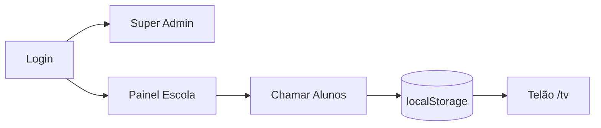

# AI Context — Smart Exit School

> Resumo executivo para ferramentas de IA. Máximo ~2 páginas.

---

## O que é

**Smart Exit School** é um SaaS frontend para escolas gerenciarem a **saída de alunos** no fim do expediente. Desenvolvido pela **AllTech Solutions**, permite cadastrar turmas/alunos, chamar alunos para portões específicos e exibir chamadas em um **telão (TV)**.

**Estado atual:** MVP/protótipo **100% client-side** — sem backend, sem banco de dados, dados em `localStorage`.

---

## Como funciona



1. **Super Admin** (`admin@alltech.com`) gerencia escolas e planos em `/admin/institutions`
2. **Escola** faz login → `/painel` com abas: Monitor, Alunos, Turmas, Portões, Import, Relatórios, Fleet, Config
3. **Operador** chama aluno no Monitor → fila persistida em `@SmartExit:called:{schoolId}`
4. **Telão** (`/tv`) lê a fila via `storage` event + polling 2s

---

## Tecnologias

| Camada | Stack |
|--------|-------|
| UI | React 19, JSX |
| Build | Vite 8 |
| Roteamento | React Router DOM 7 |
| CSS | Tailwind CSS 4 |
| Ícones | Lucide React |
| Dados | localStorage (JSON) |

**Ausente:** TypeScript, backend, API, testes, CI/CD, i18n real.

---

## Estrutura principal

```
src/
├── App.jsx              # Rotas
├── pages/
│   ├── Login.jsx        # Auth
│   ├── InstitutionsManager.jsx  # Super Admin
│   ├── InstitutionPanel.jsx     # CORE (~1300 linhas)
│   └── TvDisplay.jsx    # Telão
├── components/StudentCard.jsx   # LEGADO - não usar
└── data/students.js             # LEGADO - não usar
```

**Arquivo crítico:** `InstitutionPanel.jsx` — concentra ~90% da lógica de negócio.

---

## Regras críticas

### Autenticação
- Admin: hardcoded em `Login.jsx`
- Escola: match email+password em `@SmartExit:schools`
- Sessão: `@SmartExit:loggedSchool`
- `/painel` redireciona se sem sessão; `/admin` **não tem guard**

### Planos (SaaS tiers)
- **Basic:** operação core; sem whitelabel/dark mode/relatórios/fleet
- **Premium:** + whitelabel, dark mode, relatórios (placeholder)
- **Diamond:** + API key mock, idioma, fleet (placeholder)

### Fluxo de chamada
- Não duplicar aluno na fila (mesmo `id`)
- Portão: `callExits[id]` → `student.defaultExit` → `school.exits[0]` → `"Portão Principal"`
- Confirmar saída = remover da fila (sem histórico)

### Persistência — chaves localStorage
| Chave | Conteúdo |
|-------|----------|
| `@SmartExit:schools` | Todas instituições |
| `@SmartExit:loggedSchool` | Sessão |
| `@SmartExit:called:{id}` | Fila chamadas |
| `@SmartExit:gates:{id}` | Portões avançados |
| `@SmartExit:darkMode` | Tema |

### Armadilhas conhecidas
1. **`school.exits`** (usado no monitor) ≠ **`gatesList`** (gestão portões) — não sincronizam
2. Status `Inativo` não bloqueia login
3. Senhas em plaintext
4. `StudentCard`, `students.js`, `App.css` são código morto
5. Chaves legado `institutions`/`currentUser` — evitar

---

## Credenciais de teste

| Perfil | Email | Senha |
|--------|-------|-------|
| Admin | admin@alltech.com | admin123 |
| Basic | teste@basic.com | 123456 |
| Premium | teste@premium.com | 123456 |
| Diamond | teste@diamond.com | 123456 |

---

## Ao modificar código

1. Ler `InstitutionPanel.jsx` antes de alterar regras de negócio
2. Manter padrão: hooks no topo, early return após hooks
3. Persistir via `saveSchoolData()` — não inventar novas chaves localStorage sem necessidade
4. Respeitar restrições de plano (`school.plan`)
5. Consultar [forbidden-actions.md](forbidden-actions.md)

---

## Documentação completa

Ver `/docs/` para arquitetura, regras de negócio, API (inexistente), deploy e troubleshooting.
