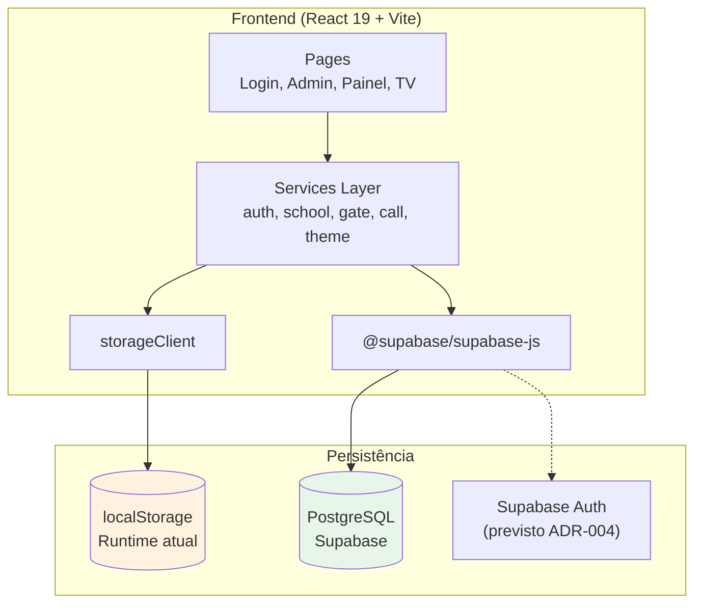
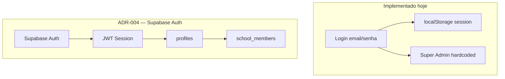

# Arquitetura — Smart Exit School

## Visão geral

O Smart Exit School é uma **SPA React** em transição arquitetural: o frontend opera via **camada de serviços (DAL)**, com persistência majoritariamente em **localStorage**, enquanto o **schema PostgreSQL (Supabase)** já está parcialmente definido e integrado de forma incremental.

## Estado da migração

| Componente | Destino | Status |
|------------|---------|--------|
| Schema Authentication Core | PostgreSQL | ✅ Migration 0001 |
| Schema Academic Core | PostgreSQL | ✅ Migration 0002 |
| `schoolService.getAllSchools()` | Supabase | ⚠️ Leitura parcial |
| Demais services | localStorage | ✅ Ativo |
| Supabase Auth | Supabase | ❌ Frontend ainda usa login legado |
| RLS | PostgreSQL | ❌ Não implementado |

## Camadas

| Camada | Tecnologia | Responsabilidade |
|--------|------------|------------------|
| Apresentação | React 19 + JSX | UI, formulários, navegação |
| Roteamento | React Router DOM 7 | Rotas declarativas |
| Estilização | Tailwind CSS 4 | Utility-first, dark mode |
| Serviços | `src/services/*` | Abstração de dados (DAL) |
| Storage local | `storageClient` | Adapter localStorage |
| Storage remoto | `lib/supabase.js` | Client Supabase (parcial) |
| Banco | PostgreSQL via Supabase | Schema relacional multi-tenant |

## Frontend

### Rotas

| Rota | Componente | Proteção |
|------|------------|----------|
| `/` | Redirect → `/login` | — |
| `/login` | `Login.jsx` | Pública |
| `/admin/institutions` | `InstitutionsManager.jsx` | **Sem guard** |
| `/painel` | `InstitutionPanel.jsx` | Sessão via `authService` |
| `/tv` | `TvDisplay.jsx` | Depende de sessão no storage |

### Comunicação Telão ↔ Painel

Via `callService.subscribeToCalls()`:
- Evento `storage` (cross-tab)
- Polling fallback a cada 2 segundos

## Backend / Banco de dados

- **Supabase:** migrations em `supabase/migrations/`, seed em `supabase/seed.sql`
- **Sem API REST própria** — acesso direto via Supabase client (parcial)
- Detalhes: [banco-de-dados.md](banco-de-dados.md)

## Documentação arquitetural

| Documento | Conteúdo |
|-----------|----------|
| [arquitetura/decisoes.md](arquitetura/decisoes.md) | ADRs congeladas |
| [arquitetura/modelagem.md](arquitetura/modelagem.md) | Modelo de domínio |
| [arquitetura/padroes.md](arquitetura/padroes.md) | Convenções de código e DB |
| [arquitetura/checklist-modelagem.md](arquitetura/checklist-modelagem.md) | Fluxo de modelagem |
| [arquitetura/arquitetura-futura.md](arquitetura/arquitetura-futura.md) | Funcionalidades planejadas |

## Fluxo de autenticação (estado atual vs alvo)

## Pontos que precisam de validação

- Unificação dos clientes Supabase (`lib/supabase.js` vs `services/core/supabaseClient.js`)
- Conclusão da Fase 2: services 100% Supabase
- Implementação de RLS antes de exposição pública
- Mapeamento de planos frontend ↔ schema PostgreSQL
