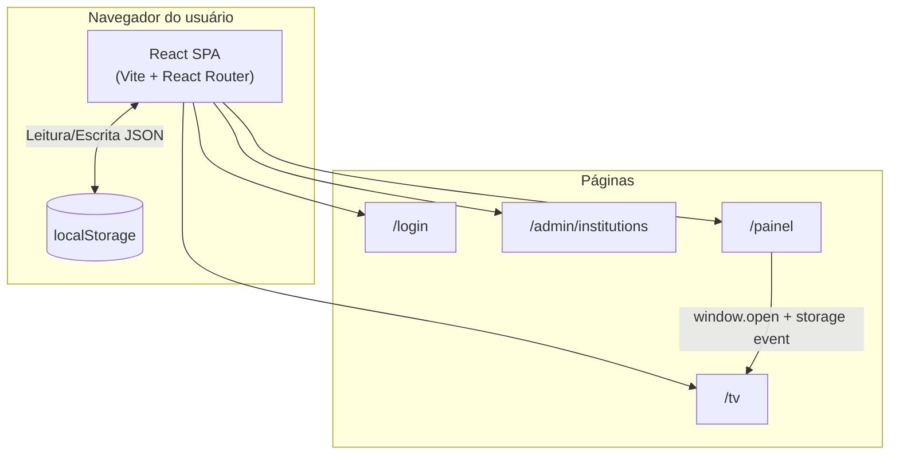
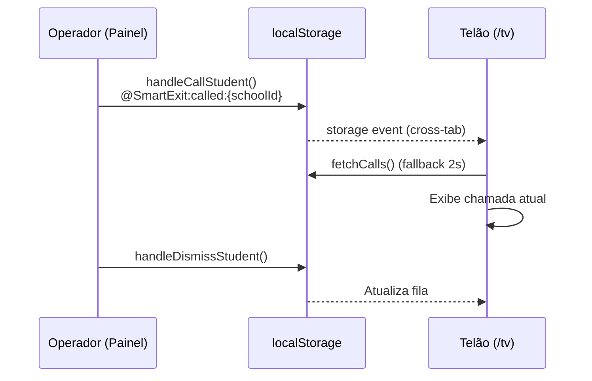
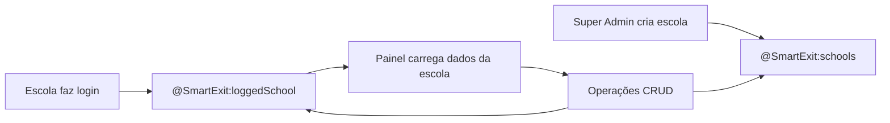
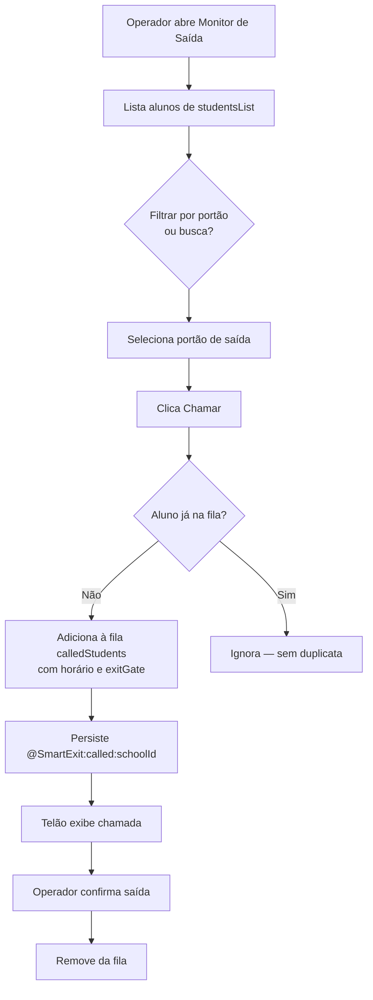
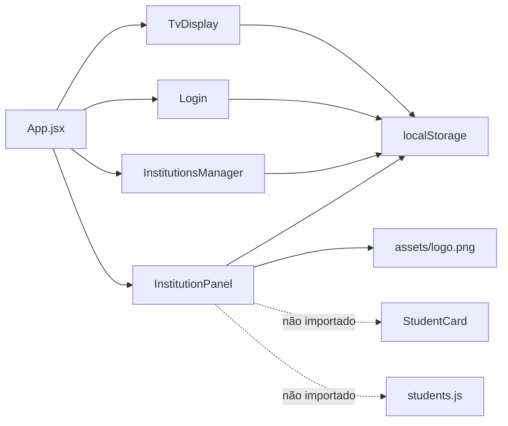

# Arquitetura — Smart Exit School

## Visão geral

O Smart Exit School é uma **SPA (Single Page Application)** 100% client-side. Toda a lógica de negócio, autenticação e persistência ocorre no navegador via **React** e **localStorage**. Não há servidor de aplicação, API REST, banco de dados ou serviços externos integrados no código atual.



## Camadas

| Camada | Tecnologia | Responsabilidade |
|--------|------------|------------------|
| Apresentação | React 19 + JSX | UI, formulários, navegação por abas |
| Roteamento | React Router DOM 7 | Rotas declarativas em `App.jsx` |
| Estilização | Tailwind CSS 4 | Utility-first, dark mode via classe `.dark` |
| Estado | React `useState` / `useEffect` | Estado local por componente |
| Persistência | `localStorage` | Escolas, sessão, chamadas, portões, preferências |
| Build | Vite 8 | Bundling, HMR, build estático |

## Frontend

### Rotas

| Rota | Componente | Proteção |
|------|------------|----------|
| `/` | Redirect → `/login` | — |
| `/login` | `Login.jsx` | Pública |
| `/admin/institutions` | `InstitutionsManager.jsx` | **Sem guard de rota** |
| `/painel` | `InstitutionPanel.jsx` | Redirect para `/login` se `@SmartExit:loggedSchool` ausente |
| `/tv` | `TvDisplay.jsx` | **Sem guard**; depende de sessão no localStorage |

### Comunicação entre abas/janelas

O telão (`TvDisplay`) sincroniza chamadas com o painel via:

1. Evento `storage` do navegador (mesma origem, abas diferentes)
2. Polling de fallback a cada **2 segundos**

## Backend

**Não identificado.** Não há pasta `server/`, `api/`, funções serverless, nem chamadas `fetch`/`axios` no código-fonte.

## Banco de dados

**Não identificado.** A persistência é feita exclusivamente via chaves `localStorage`. Ver [banco-de-dados.md](banco-de-dados.md).

## Serviços externos

| Serviço | Status |
|---------|--------|
| API REST própria | Não identificado |
| Autenticação OAuth/JWT | Não identificado |
| CDN de imagens | Apenas URLs em `students.js` legado (`pravatar.cc`) — **não utilizado** |
| Pagamentos / billing | Não identificado |
| Mapas / geolocalização | Mencionado na UI (Diamond); **não implementado** |

## Fluxo de dados



### Fluxo de cadastro institucional



## Fluxo de autenticação

```mermaid
flowchart TD
    Start([Usuário acessa /login]) --> Input[E-mail + Senha]
    Input --> AdminCheck{admin@alltech.com<br/>+ admin123?}
    AdminCheck -->|Sim| AdminPanel[/admin/institutions]
    AdminCheck -->|Não| SchoolCheck{Escola em<br/>@SmartExit:schools?}
    SchoolCheck -->|Sim| SaveSession[Salva @SmartExit:loggedSchool]
    SaveSession --> Painel[/painel]
    SchoolCheck -->|Não| Error[Exibe erro]
```

Detalhes em [autenticacao.md](autenticacao.md).

## Fluxo operacional (saída de alunos)



## Dependências externas (npm)

Todas as dependências são bibliotecas frontend instaladas via npm. Nenhuma integração runtime com serviços cloud foi identificada.

## Diagrama de componentes



## Pontos que precisam de validação

- Se haverá backend futuro (Node, Supabase, Firebase, etc.) — **não há indícios no repositório**
- Estratégia de deploy em produção (Vercel, Netlify, S3, etc.)
- Se o telão deve funcionar sem login prévio em `/painel` na mesma sessão
- Relação entre `school.exits` (legado) e `gatesList` (portões avançados) — coexistem sem sincronização automática
