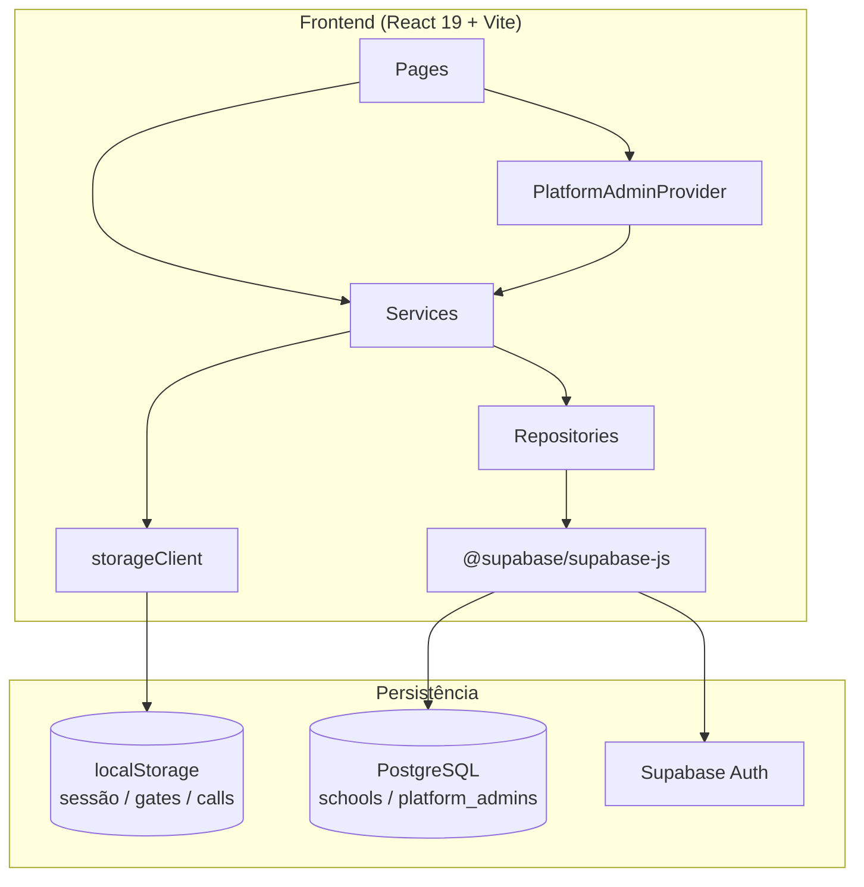

# Arquitetura — Smart Exit School

## Visão geral

SPA React com **Service Layer** + **Repository Pattern**. Persistência **híbrida**:

- **Supabase** = fonte de verdade do catálogo de escolas e da identidade Platform Admin
- **localStorage** = sessão operacional do tenant, portões, fila de chamadas e tema

```mermaid
graph TB
    subgraph Frontend["Frontend (React 19 + Vite)"]
        Pages["Pages"]
        Provider["PlatformAdminProvider"]
        Services["Services"]
        Repos["Repositories"]
        StorageClient["storageClient"]
        SupabaseJS["@supabase/supabase-js"]
    end

    subgraph Persistence["Persistência"]
        LS[("localStorage<br/>sessão / gates / calls")]
        PG[("PostgreSQL<br/>schools / platform_admins")]
        Auth["Supabase Auth"]
    end

    Pages --> Services
    Pages --> Provider
    Provider --> Services
    Services --> Repos
    Services --> StorageClient
    Repos --> SupabaseJS
    SupabaseJS --> PG
    SupabaseJS --> Auth
    StorageClient --> LS
```

## Camadas

| Camada | Local | Responsabilidade |
|--------|-------|------------------|
| Apresentação | `pages/`, `components/` | UI e rotas |
| Estado Platform | `contexts/`, `hooks/` | `isPlatformAdmin` global |
| Serviços | `services/` | Regras e orquestração |
| Repositórios | `repositories/` | Acesso a tabelas/RPC Supabase |
| Storage local | `services/core/storageClient.js` | Adapter localStorage |
| Banco | `supabase/migrations/` | Schema multi-tenant + RLS |

## Estado da migração

| Componente | Status |
|------------|--------|
| Migrations 0001–0005 (Auth, Academic, Pickup, RLS foundation) | ✅ |
| Migrations 0007–0012 (Platform Admin, policies schools, sync profiles) | ✅ |
| Catálogo `schools` via `schoolRepository` (CRUD) | ✅ |
| Platform Admin Auth + RPC + guard | ✅ |
| `gateService` / `callService` / sessão escolar | ⚠️ localStorage |
| Login operador tenant (Auth + `school_members`) | ❌ Pendente |
| Database Auditor v1 | ✅ contrato até Migration 0005 (`npm run audit:db`) |

> Não existe Migration 0006 no repositório; a numeração salta de 0005 para 0007.

## Rotas

| Rota | Componente | Proteção |
|------|------------|----------|
| `/login` | `Login.jsx` | Pública |
| `/admin/institutions` | `InstitutionsManager.jsx` | `usePlatformAdmin` (redirect se falso) |
| `/painel` | `InstitutionPanel.jsx` | Sessão `@SmartExit:loggedSchool` |
| `/tv` | `TvDisplay.jsx` | Depende da sessão no storage |

## Autenticação (resumo)

Ver [fluxos.md](fluxos.md) e [autenticacao.md](autenticacao.md).

- **Platform:** Supabase Auth → `profiles` → `platform_admins` → `is_platform_admin()` (Login exclusivo)
- **Tenant:** Auth Tenant **não implementado** (ADR-029). `authService` só gerencia sessão operacional local do painel/TV

## Banco

- Migrations: `supabase/migrations/` (até **0012**)
- Seed: `supabase/seed.sql`
- Detalhes: [banco-de-dados.md](banco-de-dados.md)

## Documentação arquitetural

| Documento | Conteúdo |
|-----------|----------|
| [arquitetura/decisoes.md](arquitetura/decisoes.md) | ADRs (inclui ADR-028 Platform vs Tenant) |
| [arquitetura/modelagem.md](arquitetura/modelagem.md) | Modelo de domínio |
| [arquitetura/padroes.md](arquitetura/padroes.md) | Convenções |
| [fluxos.md](fluxos.md) | Fluxos runtime |

## Dívida técnica conhecida

- Migrar gates/calls para Pickup Core (Supabase)
- Auth Tenant via Auth + `school_members` (ADR-029)
- Remover sessão operacional `@SmartExit:loggedSchool` após Auth Tenant
