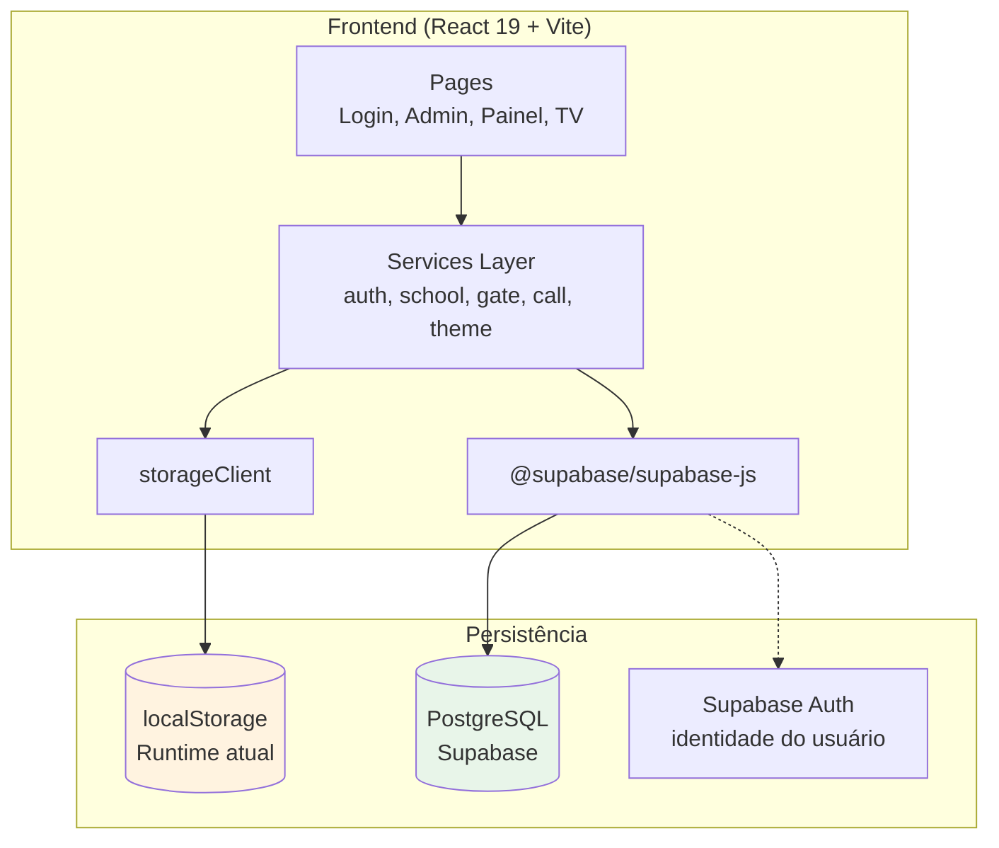

# Arquitetura — Smart Exit School

## Visão geral

O Smart Exit School é uma **SPA React** em transição arquitetural: o frontend opera via **camada de serviços (DAL)**, com persistência majoritariamente em **localStorage**, enquanto o **schema PostgreSQL (Supabase)** já está parcialmente definido e integrado de forma incremental.


```mermaid
graph TB
    subgraph Frontend["Frontend (React 19 + Vite)"]
        Pages["Pages<br/>Login, Admin, Painel, TV"]
        Services["Services Layer<br/>auth, school, gate, call, theme"]
        StorageClient["storageClient"]
        SupabaseJS["@supabase/supabase-js"]
    end

    subgraph Persistence["Persistência"]
        LS[("localStorage<br/>Runtime atual")]
        PG[("PostgreSQL<br/>Supabase")]
        Auth["Supabase Auth<br/>identidade do usuário"]
    end

    Pages --> Services
    Services --> StorageClient
    Services --> SupabaseJS
    StorageClient --> LS
    SupabaseJS --> PG
    SupabaseJS -.-> Auth

    style PG fill:#e8f5e9
    style LS fill:#fff3e0
```

## Estado da migração

| Componente | Destino | Status |
|------------|---------|--------|
| Schema Authentication Core | PostgreSQL | ✅ Migration 0001 |
| Schema Academic Core | PostgreSQL | ✅ Migration 0002 |
| Schema Enrollment Assignment | PostgreSQL | ✅ Migration 0003 |
| Schema Pickup Core | PostgreSQL | ✅ Migration 0004 |
| RLS Foundation | PostgreSQL | ✅ Migration 0005 |
| Database Auditor v1 | Tooling local | ✅ `npm run audit:db` (fundação do banco: tabelas esperadas, RLS foundation e seed baseline) |
| `schoolService` (catálogo `schools`) | Supabase | ✅ CRUD em `public.schools` |
| Portões (`gateService`) | Supabase `public.gates` | ✅ `CLOSED / PRODUCTION VERIFIED` (`8cb71ac`). Hotfix de painel `d7d0ca5` |
| Demais services operacionais | localStorage | ✅ Chamadas, turmas e alunos ainda locais |
| Supabase Auth + `school_members` | Supabase | ✅ Identidade e contexto de tenant (Feature #49). Produção publicada; um tenant escolar de homologação validado. Isolamento com duas escolas ainda não certificado |

## Camadas

| Camada | Tecnologia | Responsabilidade |
|--------|------------|------------------|
| Apresentação | React 19 + JSX | UI, formulários, navegação |
| Roteamento | React Router DOM 7 | Rotas declarativas |
| Estilização | Tailwind CSS 4 | Utility-first, dark mode |
| Serviços | `src/services/*` | Abstração de dados (DAL) |
| Storage local | `storageClient` | Adapter localStorage |
| Storage remoto | `lib/supabase.js` | Client Supabase (parcial) |
| Banco | PostgreSQL via Supabase | Schema relacional multi-tenant |

## Frontend

### Rotas

| Rota | Componente | Proteção |
|------|------------|----------|
| `/` | Redirect → `/login` | — |
| `/login` | `Login.jsx` | Pública |
| `/admin/institutions` | `InstitutionsManager.jsx` | Platform Admin via `is_platform_admin()` |
| `/painel` | `InstitutionPanel.jsx` | Membership ativa em `school_members` |
| `/tv` | `TvDisplay.jsx` | Cache operacional local; não autoriza o tenant |

### Comunicação Telão ↔ Painel

Via `callService.subscribeToCalls()`:
- Evento `storage` (cross-tab)
- Polling fallback a cada 2 segundos

## Backend / Banco de dados

- **Supabase:** migrations em `supabase/migrations/` (fundação até **0005 — RLS Foundation**), seed em `supabase/seed.sql`
- **Database Auditor v1:** `scripts/db-auditor/` via `npm run audit:db` — valida a fundação do banco local até a Migration 0005 (tabelas esperadas, RLS foundation, policies/helper functions e invariantes do seed); não substitui testes funcionais nem o futuro Audit Core (`audit_logs`)
- **Sem API REST própria** — acesso direto via Supabase client (parcial)
- Detalhes: [banco-de-dados.md](banco-de-dados.md)

## Documentação arquitetural

| Documento | Conteúdo |
|-----------|----------|
| [arquitetura/decisoes.md](arquitetura/decisoes.md) | ADRs congeladas |
| [arquitetura/modelagem.md](arquitetura/modelagem.md) | Modelo de domínio |
| [arquitetura/padroes.md](arquitetura/padroes.md) | Convenções de código e DB |
| [arquitetura/checklist-modelagem.md](arquitetura/checklist-modelagem.md) | Fluxo de modelagem |
| [arquitetura/arquitetura-futura.md](arquitetura/arquitetura-futura.md) | Funcionalidades planejadas |

## Fluxo de autenticação

O fluxo vigente está em [autenticacao.md](autenticacao.md). Resumo:

```text
Supabase Auth → auth.uid() → school_members (ativa) → school_id → tenant
Platform Admin → is_platform_admin() → /admin/institutions
```

`localStorage` e `@SmartExit:loggedSchool` não autorizam acesso. Platform Admin não é tenant de escola.

Em produção, o frontend está na Vercel e as migrations estão aplicadas no Supabase. O primeiro login escolar de homologação resolveu o Colégio Adventista de Esteio e abriu `/painel`. O Platform Admin foi para `/admin/institutions`. A membership foi provisionada por SQL privilegiado: não há UI para usuários escolares. O `seed.sql` completo não rodou em produção; só o catálogo de roles foi inserido. Detalhe e limites do teste: [autenticacao.md](autenticacao.md).

## Pontos que precisam de validação

- Unificação dos clientes Supabase (`lib/supabase.js` vs `services/core/supabaseClient.js`)
- Conclusão da Fase 2: services 100% Supabase
- Evolução da segurança além da RLS Foundation (grants, fixtures de membership, políticas por papel)
- Mapeamento de planos frontend ↔ schema PostgreSQL
