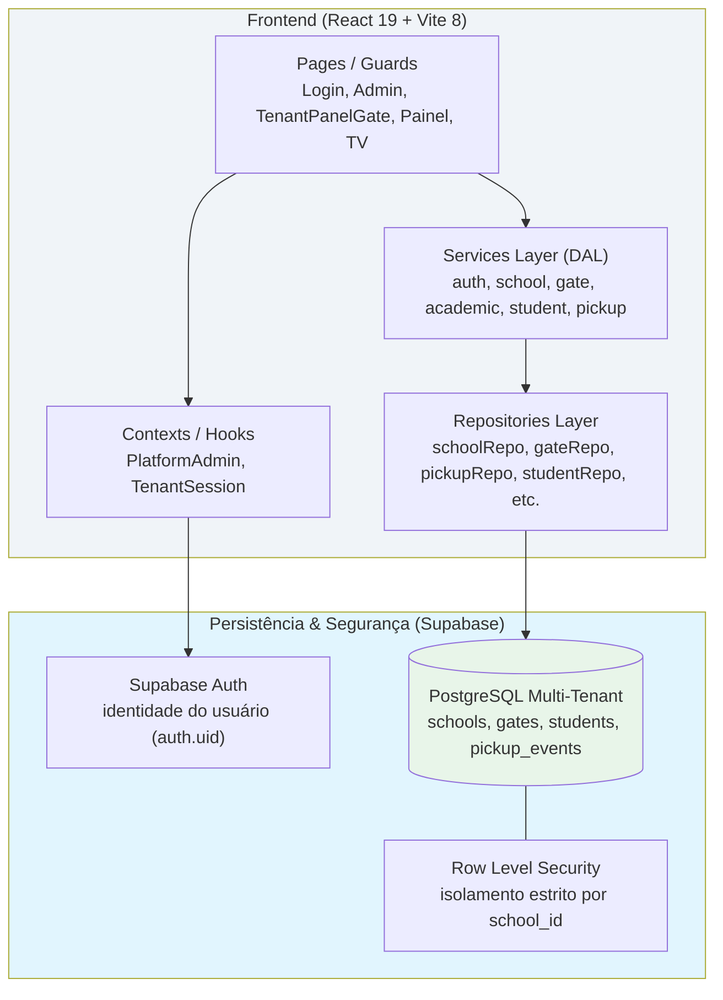

# Arquitetura — Smart Exit School

## Visão geral

O Smart Exit School é uma **Single Page Application (SPA) React** desacoplada e robusta, operando sobre uma **Camada de Abstração de Dados (DAL)** estruturada em Repositórios e Serviços, com persistência relacional completa no **Supabase (PostgreSQL)** e segurança garantida por **Row Level Security (RLS)**.

```mermaid
graph TB
    subgraph Frontend["Frontend (React 19 + Vite 8)"]
        Pages["Pages / Guards<br/>Login, Admin, TenantPanelGate, Painel, TV"]
        Contexts["Contexts / Hooks<br/>PlatformAdmin, TenantSession"]
        Services["Services Layer (DAL)<br/>auth, school, gate, academic, student, pickup"]
        Repositories["Repositories Layer<br/>schoolRepo, gateRepo, pickupRepo, studentRepo, etc."]
    end

    subgraph Backend["Persistência & Segurança (Supabase)"]
        Auth["Supabase Auth<br/>identidade do usuário (auth.uid)"]
        PG[("PostgreSQL Multi-Tenant<br/>schools, gates, students, pickup_events")]
        RLS["Row Level Security<br/>isolamento estrito por school_id"]
    end

    Pages --> Contexts
    Pages --> Services
    Services --> Repositories
    Repositories --> PG
    Contexts --> Auth
    PG --- RLS

    style PG fill:#e8f5e9
    style Frontend fill:#f0f4f8
    style Backend fill:#e1f5fe
```

---

## Estado da Migração de Persistência

Todas as verticais core do Smart Exit School já foram migradas do armazenamento local temporário para a persistência relacional oficial no Supabase:

| Componente | Destino | Status | Evidência / Detalhes |
|------------|---------|--------|----------------------|
| Schema Authentication Core | PostgreSQL | ✅ Concluído | Migrations 0001 e complementares |
| Schema Academic Core | PostgreSQL | ✅ Concluído | Migration 0002 |
| Schema Student Enrollment & Assignments | PostgreSQL | ✅ Concluído | Migration 0003 |
| Schema Pickup Core & Events | PostgreSQL | ✅ Concluído | Migration 0004 e complementares de permissão |
| RLS Foundation | PostgreSQL | ✅ Concluído | Migration 0005 e validações automatizadas |
| Database Auditor v1 | Tooling local | ✅ Ativo | Script `npm run audit:db` validando schema e baseline |
| `schoolService` (Catálogo `schools`) | Supabase | ✅ Concluído | CRUD relacional em `public.schools` |
| `gateService` (Portões da Escola) | Supabase | ✅ Concluído | Persistência relacional em `public.gates` |
| Núcleo Acadêmico (Níveis e Turmas) | Supabase | ✅ Concluído | `academicLevelService` e `academicGroupService` |
| Alunos e Matrículas | Supabase | ✅ Concluído | `studentService`, `studentEnrollmentService`, `studentGroupAssignmentService` |
| Fila Operacional de Saída (Pickup) | Supabase | ✅ Concluído | `pickupService` persistindo eventos em `public.pickup_events` |
| Autenticação & Resolução de Tenant | Supabase | ✅ Concluído | Supabase Auth + `public.school_members` + `TenantPanelGate` |

---

## Camadas da Aplicação

| Camada | Tecnologia | Responsabilidade |
|--------|------------|------------------|
| **Apresentação** | React 19 + JSX | Componentes visuais declarativos e responsivos |
| **Roteamento** | React Router DOM 7 | Rotas client-side declarativas com fallback SPA na Vercel |
| **Estilização** | Tailwind CSS 4 | Utility-first styling moderno, temas customizados e dark mode |
| **Contextos & Hooks** | React Context API | Gestão de sessão (`TenantSessionProvider`) e autoridade (`PlatformAdminProvider`) |
| **Serviços de Negócio** | `src/services/*` | Regras de negócio, normalização, cálculos e validações |
| **Repositórios** | `src/repositories/*` | Comunicação direta e isolada com o PostgreSQL via `@supabase/supabase-js` |
| **Banco & Segurança** | PostgreSQL via Supabase | Modelo relacional multi-tenant com RLS compulsório |

---

## Frontend e Proteção de Rotas

### Rotas Declaradas

| Rota | Componente | Proteção / Autoridade |
|------|------------|-----------------------|
| `/` | `Navigate` | Redirecionamento automático para `/login` |
| `/login` | `Login.jsx` | Rota pública de autenticação via Supabase Auth |
| `/admin/institutions` | `InstitutionsManager.jsx` | Protegida por `usePlatformAdmin()` (requer `is_platform_admin()`) |
| `/painel` | `TenantPanelGate.jsx` | Protegida por `TenantPanelGate` (requer sessão ativa e membership em `school_members`) |
| `/tv` | `TvDisplay.jsx` | Rota pública dedicada para exibição do telão na instituição |

### Guarda de Sessão do Tenant (`TenantPanelGate`)

O acesso ao painel da escola (`/painel`) não é montado diretamente:
1. O componente de guarda `TenantPanelGate` avalia se o usuário autenticado possui privilégio de Platform Admin (redirecionando-o para `/admin/institutions`).
2. Avalia as memberships ativas do usuário em `public.school_members`.
3. Se houver mais de uma escola ativa vinculada, apresenta uma interface de seleção explícita.
4. Se houver exatamente uma escola ativa, injeta o contexto e renderiza o `InstitutionPanel`.
5. Se não houver membership ativa ou a sessão expirar, encerra a sessão e redireciona para `/login` com mensagem descritiva.

---

## Comunicação Telão (TV) ↔ Painel Operacional

A fila de chamadas em tempo real é centralizada na tabela `public.pickup_events`:

1. **Acionamento:** O operador na portaria aciona o aluno no painel institucional. O `pickupService` insere o registro com status `called`, vinculado ao `school_id`, `student_enrollment_id` e ao `gate_id` selecionado.
2. **Exibição no Telão:** A tela do monitor (`/tv`) utiliza o `pickupService.getActiveCallsBySchool(schoolId)`, consultando em tempo real as chamadas ativas (`status = 'called'`) ordenadas por `called_at` descendente.
3. **Sincronização:** Telão e Painel realizam consulta ativa periódica através da constante `ACTIVE_CALL_POLL_MS` (5 segundos), garantindo convergência imediata entre múltiplos dispositivos e salas de aula.
4. **Conclusão:** Ao confirmar a saída do aluno com seu responsável, o evento é atualizado para `completed` com registro de `completed_at`, saindo automaticamente da fila ativa do telão.

---

## Documentação Arquitetural de Referência

| Documento | Conteúdo |
|-----------|----------|
| [arquitetura/decisoes.md](arquitetura/decisoes.md) | ADRs congeladas 001 a 028 |
| [arquitetura/modelagem.md](arquitetura/modelagem.md) | Modelo relacional de domínio |
| [arquitetura/padroes.md](arquitetura/padroes.md) | Convenções técnicas de código e banco |
| [arquitetura/checklist-modelagem.md](arquitetura/checklist-modelagem.md) | Checklist de modelagem relacional |
| [arquitetura/arquitetura-futura.md](arquitetura/arquitetura-futura.md) | Roadmap arquitetural |
| [banco-de-dados.md](banco-de-dados.md) | Detalhamento de schema, RLS e seed baseline |
| [autenticacao.md](autenticacao.md) | Modelo normativo de autenticação e sessão |
