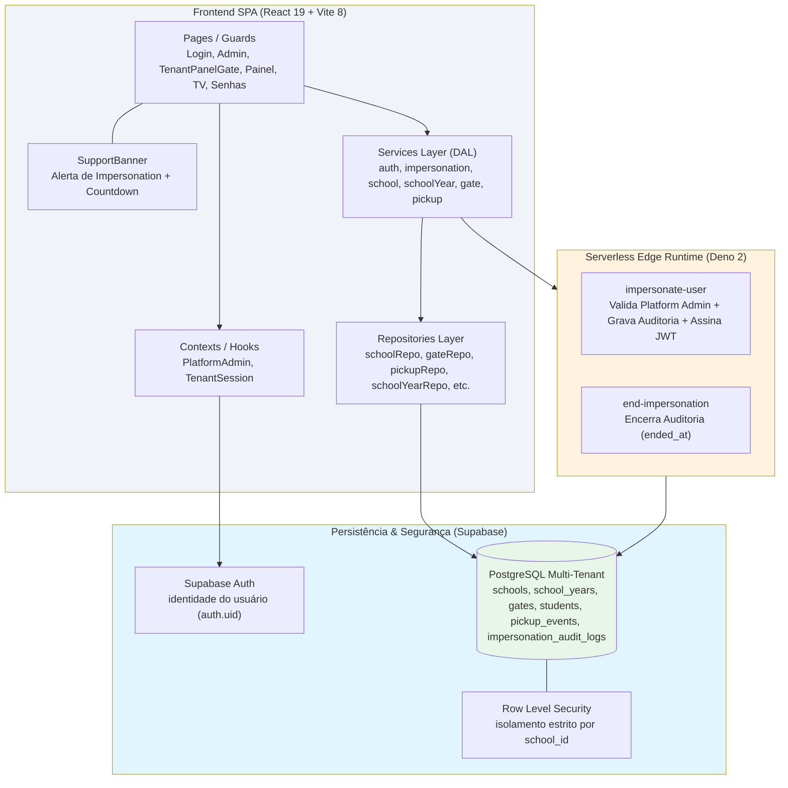

# Arquitetura — Smart Exit School

## Visão geral

O Smart Exit School é uma **Single Page Application (SPA) React** desacoplada e robusta, operando sobre uma **Camada de Abstração de Dados (DAL)** estruturada em Repositórios e Serviços, com persistência relacional completa no **Supabase (PostgreSQL)**, suporte a **Serverless Edge Functions (Deno 2)** para operações privilegiadas e segurança garantida por **Row Level Security (RLS)**.

```mermaid
graph TB
    subgraph Frontend["Frontend SPA (React 19 + Vite 8)"]
        Pages["Pages / Guards<br/>Login, Admin, TenantPanelGate, Painel, TV, Senhas"]
        Banner["SupportBanner<br/>Alerta de Impersonation + Countdown"]
        Contexts["Contexts / Hooks<br/>PlatformAdmin, TenantSession"]
        Services["Services Layer (DAL)<br/>auth, impersonation, school, schoolYear, gate, pickup"]
        Repositories["Repositories Layer<br/>schoolRepo, gateRepo, pickupRepo, schoolYearRepo, etc."]
    end

    subgraph Edge["Serverless Edge Runtime (Deno 2)"]
        EF1["impersonate-user<br/>Valida Platform Admin + Grava Auditoria + Assina JWT"]
        EF2["end-impersonation<br/>Encerra Auditoria (ended_at)"]
    end

    subgraph Backend["Persistência & Segurança (Supabase)"]
        Auth["Supabase Auth<br/>identidade do usuário (auth.uid)"]
        PG[("PostgreSQL Multi-Tenant<br/>schools, school_years, gates, students, pickup_events, impersonation_audit_logs")]
        RLS["Row Level Security<br/>isolamento estrito por school_id"]
    end

    Pages --> Contexts
    Pages --> Services
    Services --> Repositories
    Services --> Edge
    Edge --> PG
    Repositories --> PG
    Contexts --> Auth
    PG --- RLS
    Pages --- Banner

    style PG fill:#e8f5e9
    style Frontend fill:#f0f4f8
    style Edge fill:#fff3e0
    style Backend fill:#e1f5fe
```

---

## Estado da Migração de Persistência

Todas as verticais core do Smart Exit School estão consolidadas no PostgreSQL sob controle de 22 migrations versionadas:

| Componente | Destino | Status | Evidência / Detalhes |
|------------|---------|--------|----------------------|
| Schema Authentication Core | PostgreSQL | ✅ Concluído | Migrations 0001 e complementares |
| Schema Academic Core | PostgreSQL | ✅ Concluído | Migration 0002 |
| Schema Student Enrollment & Assignments | PostgreSQL | ✅ Concluído | Migration 0003 |
| Schema Pickup Core & Events | PostgreSQL | ✅ Concluído | Migration 0004 e complementares de permissão |
| RLS Foundation | PostgreSQL | ✅ Concluído | Migration 0005 e validações automatizadas |
| Database Auditor v1 | Tooling local | ✅ Ativo | Script `npm run audit:db` (93 PASS · 0 FAIL) |
| `schoolService` (Catálogo `schools`) | Supabase | ✅ Concluído | CRUD relacional em `public.schools` |
| `gateService` (Portões da Escola) | Supabase | ✅ Concluído | Persistência relacional em `public.gates` |
| Núcleo Acadêmico (Níveis e Turmas) | Supabase | ✅ Concluído | `academicLevelService` e `academicGroupService` |
| Alunos e Matrículas | Supabase | ✅ Concluído | `studentService`, `studentEnrollmentService`, `studentGroupAssignmentService` |
| Anos Letivos Configuráveis | Supabase | ✅ Concluído | Migration 0020 (`public.school_years`) e `schoolYearService` |
| Cancelamento de Chamadas | Supabase | ✅ Concluído | Migration 0019 (campo `cancelled_at` em `public.pickup_events`) |
| Endurecimento Multi-Tenant | Supabase | ✅ Concluído | Migration 0021 (revogação de TRUNCATE e restrição de grants) |
| Fundação de Impersonation | Supabase | ✅ Concluído | Migration 0022 (`public.impersonation_audit_logs` e RPC `list_platform_users`) |
| Edge Functions de Impersonation | Deno 2 / Supabase | ✅ Concluído | `impersonate-user` e `end-impersonation` em `supabase/functions/` |
| Fila Operacional de Saída (Pickup) | Supabase | ✅ Concluído | `pickupService` persistindo eventos em `public.pickup_events` |
| Autenticação & Resolução de Tenant | Supabase | ✅ Concluído | Supabase Auth + `public.school_members` + `TenantPanelGate` |

---

## Camadas da Aplicação

| Camada | Tecnologia | Responsabilidade |
|--------|------------|------------------|
| **Apresentação** | React 19 + JSX | Componentes visuais declarativos, formulários, banners e modais responsivos |
| **Roteamento** | React Router DOM 7 | Rotas client-side declarativas com fallback SPA no `vercel.json` |
| **Estilização** | Tailwind CSS 4 | Utility-first styling moderno, temas customizados e dark mode nativo |
| **Contextos & Hooks** | React Context API | Gestão de sessão (`TenantSessionProvider`) e autoridade (`PlatformAdminProvider`) |
| **Serviços de Negócio (DAL)** | `src/services/*` | Regras de negócio, normalização, cálculos, orquestração e validações |
| **Repositórios (DAL)** | `src/repositories/*` | Comunicação direta com o PostgreSQL via `@supabase/supabase-js` |
| **Serverless Edge Functions** | Deno 2 / TypeScript | Endpoints HTTP seguros para cunhagem de JWT e encerramento de auditoria |
| **Banco & Segurança** | PostgreSQL via Supabase | Modelo relacional multi-tenant com RLS compulsório |

---

## Frontend e Proteção de Rotas

### Rotas Declaradas

| Rota | Componente | Proteção / Autoridade | Descrição |
|------|------------|-----------------------|-----------|
| `/` | `Navigate` | Pública | Redirecionamento automático para `/login` |
| `/login` | `Login.jsx` | Pública | Rota de autenticação institucional com toggle de senha |
| `/recuperar-senha` | `ForgotPassword.jsx` | Pública | Solicitação de e-mail de redefinição com Brevo SMTP |
| `/redefinir-senha` | `UpdatePassword.jsx` | Pública / Token | Atualização da credencial após validação do link |
| `/admin/institutions` | `InstitutionsManager.jsx` | **Protegida por `usePlatformAdmin()`** | Painel do Super Admin com catálogo global de usuários e botão de impersonation |
| `/painel` | `TenantPanelGate.jsx` | **Protegida por `TenantPanelGate`** | Painel da escola (requer sessão ativa e membership em `school_members`) |
| `/tv` | `TvDisplay.jsx` | Pública | Monitor público telão com fila visual e anúncio sonoro inteligente |

### Guarda de Sessão do Tenant (`TenantPanelGate`)

O acesso ao painel da escola (`/painel`) não é montado diretamente:
1. O componente de guarda `TenantPanelGate` avalia se o usuário autenticado possui privilégio de Platform Admin (redirecionando-o para `/admin/institutions`).
2. Avalia as memberships ativas do usuário em `public.school_members`.
3. Se houver mais de uma escola ativa vinculada, apresenta uma interface de seleção explícita.
4. Se houver exatamente uma escola ativa, injeta o contexto e renderiza o `InstitutionPanel`.
5. Se não houver membership ativa ou a sessão expirar, encerra a sessão e redireciona para `/login` com mensagem descritiva.

---

## Modelo de Sessão de Impersonation (Suporte Técnico)

Conforme estabelecido na [ADR-029](adr/0029-impersonation-user-level-jwt.md):

1. **Início de Sessão:** O Super Admin invoca a Edge Function `impersonate-user`. A função valida a autorização via `is_platform_admin()`, insere um registro imutável em `public.impersonation_audit_logs` e assina um JWT manual com HMAC-SHA256 (`HS256`).
2. **Claims Customizadas:** O token contém claims identificadoras (`impersonated: true`, `impersonated_by`, `impersonation_log_id`) acessíveis no PostgREST via `auth.jwt()`.
3. **Controle de Auto-Refresh:** O frontend desativa temporariamente o temporizador de renovação do cliente Supabase (`supabase.auth.stopAutoRefresh()`) e fornece a sentinela `refresh_token: 'impersonation_no_refresh'`, evitando requisições espúrias a `auth.sessions`.
4. **Backup e Restauração:** A sessão do Super Admin é arquivada em `sessionStorage` (`ses_admin_session_backup`). Ao finalizar o atendimento (ou após 45 minutos), a Edge Function `end-impersonation` atualiza o log (`ended_at`), limpa os dados do tenant em cache e restaura a sessão original do admin reativando o auto-refresh (`startAutoRefresh()`).

---

## Comunicação Telão (TV) ↔ Painel Operacional

A fila de chamadas em tempo real é centralizada na tabela `public.pickup_events`:

1. **Acionamento:** O operador na portaria aciona o aluno no painel institucional. O `pickupService` insere o registro com status `called`, vinculado ao `school_id`, `student_enrollment_id` e ao `gate_id` selecionado.
2. **Cancelamento Operacional:** Se uma chamada for disparada por engano, o operador pode cancelá-la através do modal de confirmação. O status transiciona para `cancelled` e o timestamp `cancelled_at` é gravado para fins de auditoria, retirando o aluno da fila ativa.
3. **Exibição e Anúncio Sonoro no Telão:** A tela do monitor (`/tv`) consulta periodicamente as chamadas ativas (`status = 'called'`) e reproduz sequencialmente um chime harmônico seguido de anúncio por voz (Web Speech API) com fila assíncrona e debounce.
4. **Conclusão:** Ao confirmar a saída do aluno com seu responsável, o evento é atualizado para `completed` com registro de `completed_at`, saindo automaticamente da fila ativa do telão.

---

## Documentação Arquitetural de Referência

| Documento | Conteúdo |
|-----------|----------|
| [adr/0029-impersonation-user-level-jwt.md](adr/0029-impersonation-user-level-jwt.md) | ADR-029: Impersonation User-Level com JWT Manual |
| [impersonation-support-flow.md](impersonation-support-flow.md) | Guia completo de suporte técnico operacional |
| [infra/smtp-brevo-setup.md](infra/smtp-brevo-setup.md) | Configuração de relay SMTP Brevo para e-mail transacional |
| [arquitetura/decisoes.md](arquitetura/decisoes.md) | ADRs consolidadas 001 a 028 |
| [arquitetura/modelagem.md](arquitetura/modelagem.md) | Modelo relacional de domínio |
| [arquitetura/padroes.md](arquitetura/padroes.md) | Convenções técnicas de código e banco |
| [banco-de-dados.md](banco-de-dados.md) | Detalhamento de schema, RLS e seed baseline |
| [autenticacao.md](autenticacao.md) | Modelo normativo de autenticação e sessão |
