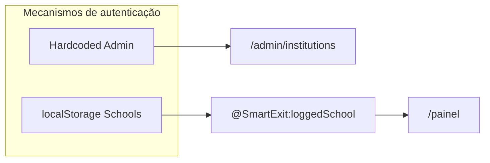
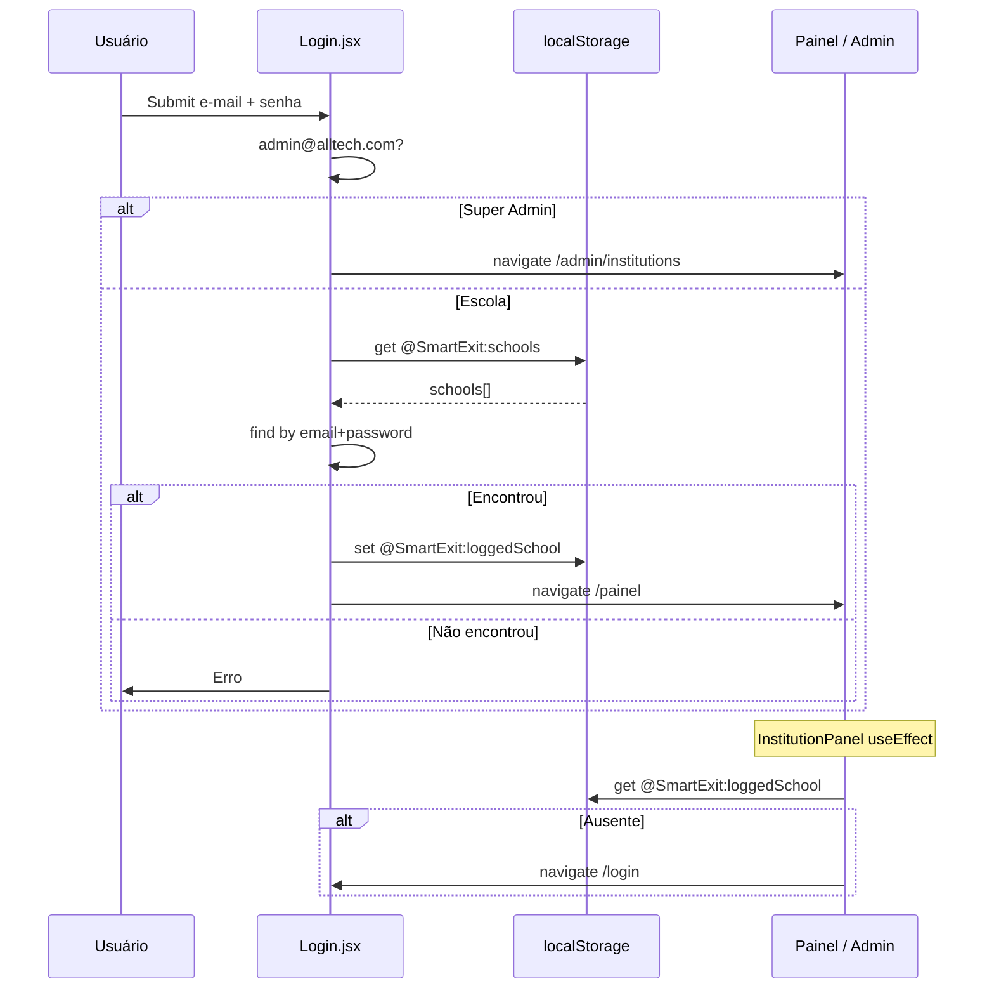

# Autenticação — Smart Exit School

## Visão geral

O sistema utiliza autenticação **100% client-side**, sem servidor de autenticação, tokens JWT, cookies de sessão ou OAuth.

A "sessão" consiste em objetos JSON persistidos no `localStorage` do navegador.



---

## Sistema de login

**Arquivo:** `src/pages/Login.jsx`  
**Rota:** `/login`

### Formulário

| Campo | Tipo HTML | Validação |
|-------|-----------|-----------|
| E-mail | `email`, required | HTML5 required |
| Senha | `password`, required | HTML5 required |

### Fluxo de decisão

1. **Super Admin** — comparação literal:
   - E-mail: `admin@alltech.com`
   - Senha: `admin123`
   - Sucesso → `navigate("/admin/institutions")`

2. **Escola cliente** — busca em `@SmartExit:schools`:
   - Match: `school.email === email && school.password === password`
   - Sucesso → salva `@SmartExit:loggedSchool` → `navigate("/painel")`

3. **Falha** — exibe: `"E-mail ou senha incorretos."`

### Credenciais de teste (MOCK_SCHOOLS)

| E-mail | Senha | Plano |
|--------|-------|-------|
| teste@basic.com | 123456 | Basic |
| teste@premium.com | 123456 | Premium |
| teste@diamond.com | 123456 | Diamond |

---

## Sistema de sessão

### Escola logada

| Aspecto | Detalhe |
|---------|---------|
| Chave | `@SmartExit:loggedSchool` |
| Formato | JSON serializado (objeto School completo) |
| Criação | No login bem-sucedido |
| Atualização | A cada `saveSchoolData()` no painel |
| Destruição | `localStorage.removeItem("@SmartExit:loggedSchool")` no logout |
| Expiração | **Não implementada** |
| Renovação | **Não implementada** |

### Super Admin

| Aspecto | Detalhe |
|---------|---------|
| Persistência | **Nenhuma** — não salva flag de admin logado |
| Logout | Apenas `navigate("/login")` |
| Proteção de rota | **Ausente** — `/admin/institutions` acessível sem login |

---

## Fluxo de autenticação completo



---

## Controle de acesso por rota

| Rota | Guard | Mecanismo |
|------|-------|-----------|
| `/login` | Pública | — |
| `/admin/institutions` | ❌ Nenhum | URL aberta |
| `/painel` | ✅ Parcial | `useEffect` verifica `@SmartExit:loggedSchool` |
| `/tv` | ❌ Nenhum | Funciona se houver sessão; caso contrário não carrega dados |

### Implementação do guard do painel

```javascript
// InstitutionPanel.jsx — useEffect
const loggedSchool = JSON.parse(localStorage.getItem("@SmartExit:loggedSchool"))
if (!loggedSchool) {
  navigate("/login")
}
```

**Limitação:** Guard executado apenas no client-side; não impede acesso direto à URL antes do React montar.

---

## Recuperação de acesso

**Não identificado.**

Não há:

- "Esqueci minha senha"
- Reset por e-mail
- Fluxo de recuperação de conta
- Contato com suporte integrado

Alteração de senha: apenas Super Admin edita no modal de instituição.

---

## Segurança da autenticação

| Aspecto | Estado atual | Risco |
|---------|--------------|-------|
| Armazenamento de senha | Texto plano em localStorage | Alto |
| Credenciais admin | Hardcoded no source | Alto |
| HTTPS | Depende do hosting | Médio |
| Brute force | Sem rate limit | Médio |
| Session hijacking | localStorage acessível via XSS | Alto |
| CSRF | N/A (sem server) | Baixo |
| Status Inativo | Não bloqueia login | Médio |

---

## Logout

### Escola (`InstitutionPanel`)

```javascript
localStorage.removeItem("@SmartExit:loggedSchool")
navigate("/login")
```

### Super Admin (`InstitutionsManager`)

```javascript
navigate("/login")
// Não limpa localStorage
```

**Implicação:** Sessão de escola pode permanecer ativa após Super Admin "logout".

---

## Chaves relacionadas (legado)

| Chave | Uso na autenticação |
|-------|---------------------|
| `currentUser` | Escrita em `handleSaveColors()` — **não usada no login** |
| `institutions` | Duplicata parcial — **não usada no login** |

---

## Pontos que precisam de validação

- Implementar guard real para `/admin/institutions`
- Bloquear login de instituições com `status: "Inativo"`
- Estratégia de autenticação para produção (JWT, session cookie, OAuth)
- Política de expiração de sessão
- Fluxo de recuperação de senha
