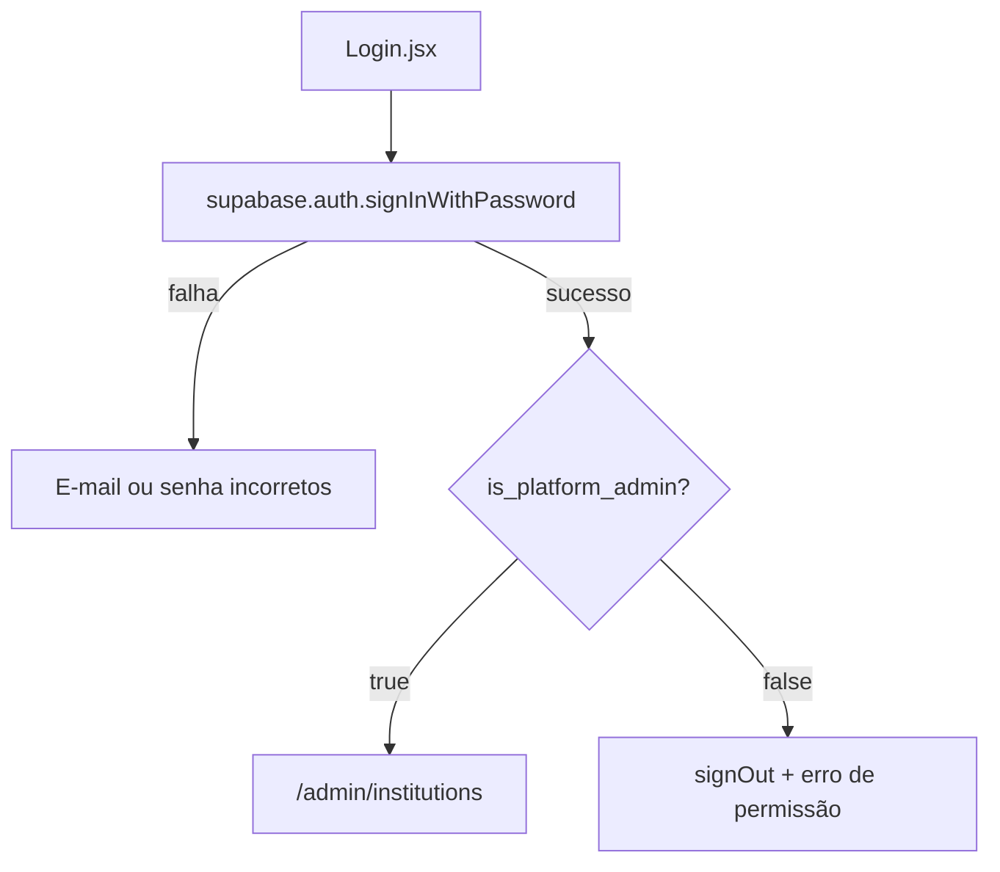

# Autenticação — Smart Exit School

## Visão geral

Dois domínios distintos (ADR-028):

| Domínio | Mecanismo atual | Status |
|---------|-----------------|--------|
| **Platform** | Supabase Auth + `platform_admins` + RPC `is_platform_admin()` | ✅ |
| **Tenant (instituição)** | Auth via `school_members` | 🚧 ADR-029 — não implementado |

```mermaid
flowchart TD
    Login[Login.jsx] --> AuthTry[supabase.auth.signInWithPassword]
    AuthTry -->|falha| Err[E-mail ou senha incorretos]
    AuthTry -->|sucesso| RPC{is_platform_admin?}
    RPC -->|true| Admin["/admin/institutions"]
    RPC -->|false| SignOut[signOut + erro de permissão]
```

`Login.jsx` autentica **somente** Platform Admin. Não há fallback de login por credenciais em `public.schools` (ADR-005).

---

## Platform Admin

**Arquivos:** `Login.jsx`, `platformAdminService`, `platformAdminRepository`, `PlatformAdminProvider`, `usePlatformAdmin`

### Fluxo

1. `supabase.auth.signInWithPassword({ email, password })`
2. Trigger `on_auth_user_created` → `public.profiles` (usuário novo)
3. Linha em `public.platform_admins`
4. RPC `public.is_platform_admin()` via `platformAdminRepository`
5. Se `true` → `/admin/institutions`
6. Se Auth OK e RPC `false` → `signOut()` + erro de permissão

### Sessão Platform

| Aspecto | Detalhe |
|---------|---------|
| Persistência | Sessão Supabase Auth (JWT) |
| Estado UI | `PlatformAdminProvider` |
| Guard | `InstitutionsManager` + `usePlatformAdmin` |
| Logout | `supabase.auth.signOut()` |

### Provisionamento local

1. Criar usuário no Auth (Studio)
2. Profile via trigger (Migration 0010)
3. Migration 0009 promove `admin@alltech.com` quando o profile existir, ou inserir em `platform_admins` manualmente

---

## Operadores da instituição (Auth Tenant)

**Status:** limitação temporária documentada em ADR-029.

- `public.schools` **não** tem `email`/`password` (ADR-005)
- Login de operador escolar **ainda não existe**
- `authService` gerencia apenas a sessão operacional legado `@SmartExit:loggedSchool` (painel/TV), **sem** autenticar
- Planejado: Supabase Auth + `school_members` + roles + RLS; remoção completa da sessão legado

---

## Relacionados

- [fluxos.md](fluxos.md)
- [permissoes.md](permissoes.md)
- ADR-004, ADR-005, ADR-028, ADR-029 em [arquitetura/decisoes.md](arquitetura/decisoes.md)
