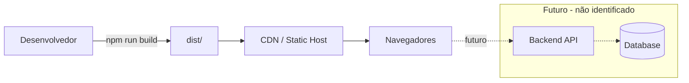

# Deploy — Smart Exit School

## Ambiente de produção

**Não identificado.** O repositório não contém:

- Configuração de hosting (Vercel, Netlify, AWS, Azure, etc.)
- Pipeline CI/CD
- Dockerfile ou orquestração
- Domínio ou URL de produção documentados
- Variáveis de ambiente de produção

O projeto está configurado como **aplicação estática** gerada pelo Vite.

---

## Variáveis de ambiente

**Não identificadas.**

- Não há arquivo `.env`, `.env.example` ou `.env.production`
- Credenciais Super Admin estão **hardcoded** em `Login.jsx`
- Não há uso de `import.meta.env.VITE_*`

| Variável | Status |
|----------|--------|
| `VITE_API_URL` | Não existe |
| `VITE_ADMIN_EMAIL` | Não existe (hardcoded) |
| Secrets / API keys | Não configurados |

---

## Build

### Comando

```bash
npm run build
```

### Output

- Diretório: `dist/`
- Conteúdo: HTML, JS, CSS bundled + assets de `public/`
- Tipo: SPA estática (requer fallback para `index.html` em rotas client-side)

### Configuração Vite

Arquivo: `vite.config.js`

```javascript
export default defineConfig({
  plugins: [react(), tailwindcss()],
})
```

**Sem customizações de:**

- `base` (path prefix)
- `build.outDir`
- `build.sourcemap`
- Proxy de API

### Preview local do build

```bash
npm run preview
```

Serve a pasta `dist/` localmente para validação pré-deploy.

---

## Publicação

### Requisitos do hosting

Por ser SPA com React Router (`BrowserRouter`):

1. Servir arquivos estáticos de `dist/`
2. **Fallback:** todas as rotas (`/login`, `/painel`, `/tv`, etc.) devem retornar `index.html`
3. HTTPS recomendado (especialmente considerando dados sensíveis em localStorage)

### Provedores compatíveis (não configurados)

| Provedor | Compatibilidade | Config necessária |
|----------|-----------------|-------------------|
| Vercel | ✅ | `vercel.json` rewrite (ausente) |
| Netlify | ✅ | `_redirects` ou `netlify.toml` (ausente) |
| GitHub Pages | ⚠️ | Requer `base` no Vite se subpath |
| AWS S3 + CloudFront | ✅ | Error document → index.html |
| Nginx | ✅ | `try_files $uri /index.html` |

### Exemplo Nginx (referência — não presente no repo)

```nginx
location / {
    root /usr/share/nginx/html;
    try_files $uri $uri/ /index.html;
}
```

---

## Configurações necessárias para deploy mínimo

1. `npm ci` ou `npm install`
2. `npm run build`
3. Upload/deploy de `dist/`
4. Configurar SPA fallback no servidor
5. Habilitar HTTPS

---

## Limitações do deploy atual

| Limitação | Impacto |
|-----------|---------|
| Sem backend | Dados não sincronizam entre dispositivos |
| localStorage | Cada browser tem dados isolados |
| Credenciais no bundle | Admin password visível no JS compilado |
| Sem CDN config | Assets servidos do origin |
| Sem cache headers | Não configurado no Vite |

---

## Diagrama de deploy sugerido (não implementado)



---

## Pontos que precisam de validação

- Provedor de hosting escolhido
- Domínio de produção
- Estratégia de backend antes de deploy multi-usuário real
- Remoção/substituição de credenciais hardcoded antes de produção
- Configuração de analytics/monitoramento
