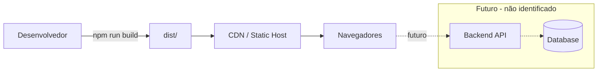

# Deploy — Smart Exit School

## Ambiente de produção

O frontend está publicado na Vercel em `https://smart-exit-school.vercel.app`. O banco é o projeto Supabase `yantfnekslrzhussewdh`. As migrations de `main` já foram aplicadas. O `supabase/seed.sql` completo não foi executado nesse banco.

O repositório continua sem:

- `vercel.json` (rewrite de SPA ausente no Git)
- Pipeline CI/CD
- Dockerfile ou orquestração
- Variáveis de ambiente de produção versionadas

O projeto é uma **aplicação estática** gerada pelo Vite. A publicação na Vercel não adiciona esses arquivos ao repositório.

---

## Variáveis de ambiente

O projeto utiliza variáveis Vite para Supabase. Arquivo `.env.local` é ignorado pelo Git (`.gitignore`).

| Variável | Obrigatória | Descrição |
|----------|-------------|-----------|
| `VITE_SUPABASE_URL` | Sim (para Supabase) | URL do projeto Supabase |
| `VITE_SUPABASE_ANON_KEY` | Sim (para Supabase) | Chave anon/public do Supabase |

**Recomendação:** criar `.env.example` versionado com placeholders (não contém secrets).

A identidade é Supabase Auth. Platform Admin usa `is_platform_admin()`. O tenant usa membership ativa. Não há credencial de admin hardcoded como autoridade, e `localStorage` não autoriza acesso.

| Variável | Status |
|----------|--------|
| `VITE_API_URL` | Não existe |
| `VITE_ADMIN_EMAIL` | Não existe |

---

## Build

### Comando

```bash
npm run build
```

### Output

- Diretório: `dist/`
- Conteúdo: HTML, JS, CSS bundled + assets de `public/`
- Tipo: SPA estática (requer fallback para `index.html` em rotas client-side)

### Configuração Vite

Arquivo: `vite.config.js`

```javascript
export default defineConfig({
  plugins: [react(), tailwindcss()],
})
```

**Sem customizações de:**

- `base` (path prefix)
- `build.outDir`
- `build.sourcemap`
- Proxy de API

### Preview local do build

```bash
npm run preview
```

Serve a pasta `dist/` localmente para validação pré-deploy.

---

## Publicação

### Requisitos do hosting

Por ser SPA com React Router (`BrowserRouter`):

1. Servir arquivos estáticos de `dist/`
2. **Fallback:** todas as rotas (`/login`, `/painel`, `/tv`, etc.) devem retornar `index.html`
3. HTTPS recomendado (especialmente considerando dados sensíveis em localStorage)

### Provedores compatíveis (não configurados)

| Provedor | Compatibilidade | Config necessária |
|----------|-----------------|-------------------|
| Vercel | ✅ em uso | `vercel.json` rewrite ainda ausente no repositório |
| Netlify | ✅ | `_redirects` ou `netlify.toml` (ausente) |
| GitHub Pages | ⚠️ | Requer `base` no Vite se subpath |
| AWS S3 + CloudFront | ✅ | Error document → index.html |
| Nginx | ✅ | `try_files $uri /index.html` |

### Exemplo Nginx (referência — não presente no repo)

```nginx
location / {
    root /usr/share/nginx/html;
    try_files $uri $uri/ /index.html;
}
```

---

## Configurações necessárias para deploy mínimo

1. `npm ci` ou `npm install`
2. `npm run build`
3. Upload/deploy de `dist/`
4. Configurar SPA fallback no servidor
5. Habilitar HTTPS

---

## Limitações do deploy atual

| Limitação | Impacto |
|-----------|---------|
| Sem backend | Dados não sincronizam entre dispositivos |
| localStorage | Cada browser tem dados isolados |
| Credenciais no bundle | Admin password visível no JS compilado |
| Sem CDN config | Assets servidos do origin |
| Sem cache headers | Não configurado no Vite |

---

## Diagrama de deploy sugerido (não implementado)


```mermaid
flowchart LR
    Dev[Desenvolvedor] -->|npm run build| Dist[dist/]
    Dist --> CDN[CDN / Static Host]
    CDN --> Users[Navegadores]

    subgraph Future["Futuro - não identificado"]
        API[Backend API]
        DB[(Database)]
    end

    Users -.->|futuro| API
    API -.-> DB
```

---

## Pontos que precisam de validação

- Fallback de SPA na Vercel: na homologação, `/painel` e `/admin/institutions` chegaram a responder `404 NOT_FOUND` do Vercel. Esse 404 não prova autorização nem RLS. Ver [troubleshooting.md](troubleshooting.md) e [autenticacao.md](autenticacao.md).
- `vercel.json` ainda não está no repositório
- Configuração de analytics/monitoramento
- Fluxo de convite de usuários escolares antes da comercialização em escala
