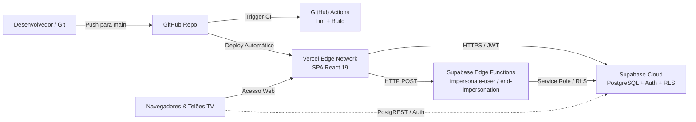

# Deploy — Smart Exit School

## Ambiente de Produção

O Smart Exit School opera em modelo arquitetural desacoplado, combinando um frontend estático de alta performance hospedado na **Vercel** com um backend escalável e Serverless Edge Functions gerenciados no **Supabase Cloud**:

* **Frontend (Vercel):** `https://smart-exit-school.vercel.app`
* **Backend / Database (Supabase Cloud):** Projeto `yantfnekslrzhussewdh` (PostgreSQL com RLS ativo)
* **Serverless Edge Functions (Supabase Cloud):** Endpoints `impersonate-user` e `end-impersonation` executados sob runtime Deno
* **Automação & CI:** GitHub Actions executando lint e build em Pull Requests e pushes para a branch `main`

---

## Arquitetura de Deploy


```mermaid
flowchart LR
    Dev[Desenvolvedor / Git] -->|Push para main| Repo[GitHub Repo]
    Repo -->|Trigger CI| GHA[GitHub Actions<br/>Lint + Build]
    Repo -->|Deploy Automático| Vercel[Vercel Edge Network<br/>SPA React 19]
    Vercel -->|HTTPS / JWT| Supabase[Supabase Cloud<br/>PostgreSQL + Auth + RLS]
    Vercel -->|HTTP POST| Edge[Supabase Edge Functions<br/>impersonate-user / end-impersonation]
    Edge -->|Service Role / RLS| Supabase
    Users[Navegadores & Telões TV] -->|Acesso Web| Vercel
    Users -.->|PostgREST / Auth| Supabase
```

---

## Roteamento e Fallback SPA (`vercel.json`)

Como a aplicação é uma Single Page Application (SPA) que utiliza o `react-router-dom` no modo `BrowserRouter`, todas as rotas client-side (`/login`, `/recuperar-senha`, `/redefinir-senha`, `/painel`, `/admin/institutions`, `/tv`) exigem redirecionamento interno para o `index.html`.

O arquivo [vercel.json](../vercel.json) está versionado na raiz do repositório garantindo esse fallback:

```json
{
  "rewrites": [
    {
      "source": "/(.*)",
      "destination": "/index.html"
    }
  ]
}
```

Isso elimina erros de rota `404 NOT_FOUND` no servidor de borda e delega o roteamento e os guards de autorização para a aplicação React.

---

## Variáveis de Ambiente em Produção

### Frontend (Vercel)
No painel da Vercel (Project Settings → Environment Variables), configure:

| Variável | Obrigatória | Finalidade |
|---|---|---|
| `VITE_SUPABASE_URL` | Sim | URL HTTPS do projeto Supabase de produção |
| `VITE_SUPABASE_ANON_KEY` | Sim | Chave pública `anon` com permissões restritas pelo RLS |

> **Segurança:** A identidade do usuário é validada via **Supabase Auth**. Não existem credenciais, e-mails administrativos ou senhas hardcoded no bundle compilado (`dist/`). O controle de acesso a dados é governado pelo motor de Row Level Security (RLS) diretamente no PostgreSQL.

---

## Deploy das Edge Functions (Supabase Cloud)

As Serverless Edge Functions de personificação e suporte operam em ambiente Deno gerenciado pelo Supabase.

### Comandos de Publicação
```bash
# 1. Vincular o projeto ao Supabase Cloud (se ainda não vinculado)
npx supabase link --project-ref yantfnekslrzhussewdh

# 2. Publicar a função de início de impersonation
npx supabase functions deploy impersonate-user

# 3. Publicar a função de encerramento de impersonation
npx supabase functions deploy end-impersonation
```

### Configuração de Secrets nas Edge Functions
As Edge Functions utilizam as seguintes variáveis no ambiente Deno:
* `SUPABASE_URL` *(injetada automaticamente pelo Supabase)*
* `SUPABASE_ANON_KEY` *(injetada automaticamente pelo Supabase)*
* `SUPABASE_SERVICE_ROLE_KEY` *(injetada automaticamente pelo Supabase)*
* `SUPABASE_JWT_SECRET` *(segredo criptográfico HMAC-SHA256 para assinatura do JWT manual; fallback suportado em código para `JWT_SECRET`)*

Caso o segredo de assinatura não seja herdado automaticamente no projeto de produção, configure via CLI:
```bash
npx supabase secrets set SUPABASE_JWT_SECRET="seu-jwt-secret-de-producao"
```

---

## Processo de Build do Frontend

O build de produção é gerado pelo Vite:

```bash
npm run build
```

* **Diretório de saída:** `dist/`
* **Conteúdo:** HTML, JavaScript minificado, CSS com Tailwind 4 e assets estáticos otimizados.

Para testar o bundle de produção localmente antes do deploy:

```bash
npm run preview
```

---

## Checklist de Deploy de Nova Versão

1. **Validação Local:**
   - `npm run lint` (verificação de código limpo)
   - `npm test` (147 testes automatizados passando)
   - `npm run audit:db` / `npm run validate:rls` (se houver migrações de banco)
2. **Entrega Git:**
   - Abertura de Pull Request para a branch `main`.
   - Validação dos checks do GitHub Actions (CI).
   - Aprovação humana formalizada via Decision Gate (`G-MERGE`).
3. **Publicação Contínua:**
   - Ao realizar o merge na `main`, a Vercel compila e disponibiliza a nova versão em produção automaticamente.
   - Se houver novas migrations, aplicar via `npx supabase db push`.
   - Se houver alterações em `supabase/functions/`, executar o deploy via `npx supabase functions deploy`.
