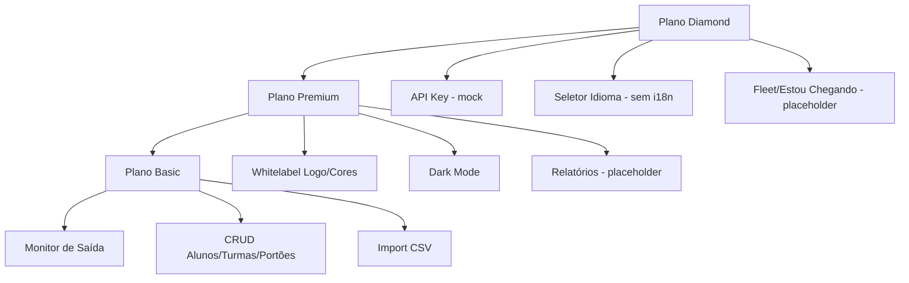

# Funcionalidades — Smart Exit School

Mapeamento completo do estado atual, organizado por perfil de usuário.

---

## Super Admin (AllTech Solutions)

**Rota:** `/admin/institutions`  
**Autenticação:** `admin@alltech.com` / `admin123`

### Implementadas

| Funcionalidade | Descrição | Arquivo |
|----------------|-----------|---------|
| Dashboard de métricas | Total escolas, ativas, alunos gerenciados | `InstitutionsManager.jsx` |
| Listagem de instituições | Tabela com nome, e-mail, plano, alunos, status | `InstitutionsManager.jsx` |
| Busca | Por nome ou e-mail | `InstitutionsManager.jsx` |
| Criar instituição | Modal com nome, e-mail, senha, plano | `InstitutionsManager.jsx` |
| Editar instituição | Modal pré-preenchido | `InstitutionsManager.jsx` |
| Excluir instituição | Com confirmação | `InstitutionsManager.jsx` |
| Suspender/Reativar | Toggle status Ativo/Inativo | `InstitutionsManager.jsx` |
| Logout | Navega para `/login` | `InstitutionsManager.jsx` |
| Migração plano Pro → Basic | Automática no load | `InstitutionsManager.jsx` |

### Incompletas / Ausentes

| Funcionalidade | Status |
|----------------|--------|
| Guard de rota (proteção da URL) | **Não implementado** |
| Impersonar escola (login como cliente) | **Não identificado** |
| Billing / faturamento | **Não identificado** |
| Logs de auditoria | **Não identificado** |
| Gestão de planos Trial (expiração 14 dias) | Plano existe no select; **lógica ausente** |

---

## Operador da escola (Painel institucional)

**Rota:** `/painel`  
**Autenticação:** credenciais cadastradas em `@SmartExit:schools`

### Aba: Monitor de Saída ✅

| Funcionalidade | Status |
|----------------|--------|
| Listar alunos disponíveis | ✅ |
| Buscar por nome ou turma | ✅ |
| Filtrar por portão | ✅ |
| Selecionar portão por aluno | ✅ |
| Chamar aluno (adicionar à fila) | ✅ |
| Fila de chamada com horário | ✅ |
| Confirmar saída (remover da fila) | ✅ |
| Abrir telão em nova aba | ✅ |
| Impedir chamada duplicada | ✅ |

### Aba: Gestão de Alunos ✅

| Funcionalidade | Status |
|----------------|--------|
| Cadastrar aluno | ✅ |
| Editar aluno | ✅ |
| Excluir aluno | ✅ |
| Vincular turma | ✅ |
| Definir saída padrão | ✅ |
| Herdar saída da turma | ✅ |
| Seleção em massa (checkbox) | ✅ |
| Alteração em massa (turma/saída) | ✅ |
| Contador de alunos | ✅ |

### Aba: Gestão de Turmas ✅

| Funcionalidade | Status |
|----------------|--------|
| Cadastrar turma | ✅ |
| Editar turma | ✅ |
| Excluir turma | ✅ |
| Definir saída padrão da turma | ✅ |
| Propagação ao renomear turma | ✅ |
| Edição em massa de turmas | ⚠️ Lógica existe; **UI ausente** |

### Aba: Gestão de Portões ⚠️

| Funcionalidade | Status |
|----------------|--------|
| CRUD portões avançados (nome, horário) | ✅ |
| Vincular turmas como saída padrão | ✅ |
| Propagação para alunos | ✅ |
| CRUD `school.exits` (legado) | ⚠️ Handlers existem; **UI não exposta** |
| Uso de gatesList no monitor | ❌ Monitor usa `school.exits` |

### Aba: Importar Dados ✅

| Funcionalidade | Status |
|----------------|--------|
| Upload CSV | ✅ |
| Criação automática de turmas | ✅ |
| Detecção de duplicatas | ✅ |
| Encoding windows-1252 | ✅ |

### Aba: Relatórios Avançados 🔒 / 🚧

| Plano | Comportamento |
|-------|---------------|
| Basic | Tela de upgrade (bloqueado) |
| Premium/Diamond | Placeholder: "Em breve: Gráficos e inteligência de dados" |

**Funcionalidade incompleta** — apenas UI de bloqueio/placeholder.

### Aba: Rotas & "Estou Chegando" 🔒 / 🚧

| Plano | Comportamento |
|-------|---------------|
| Basic/Premium | Tela de upgrade Diamond |
| Diamond | Placeholder: "Em breve: Painel de monitoramento..." |

**Funcionalidade incompleta** — geolocalização e app dos pais não implementados.

### Aba: Configurações ⚠️

| Funcionalidade | Plano | Status |
|----------------|-------|--------|
| Visualizar dados cadastrais | Todos | ✅ (readonly) |
| Upload logo customizado | Premium+ | ✅ |
| Remover logo | Premium+ | ✅ |
| Cores whitelabel | Premium+ | ✅ |
| Restaurar cores padrão | Premium+ | ✅ |
| Dark mode toggle | Premium+ | ✅ |
| Seletor de idioma | Diamond | ✅ (salva; **não traduz UI**) |
| Gerar API Key | Diamond | ✅ (não consumida) |
| Reset de fábrica | Todos | ✅ |

### Funcionalidades administrativas gerais

| Funcionalidade | Status |
|----------------|--------|
| Logout | ✅ |
| Seed MOCK_SCHOOLS (primeiro acesso) | ✅ |
| Migração classes string → object | ✅ |

---

## Público / Telão

**Rota:** `/tv`

| Funcionalidade | Status |
|----------------|--------|
| Exibir chamada atual | ✅ |
| Exibir chamadas recentes | ✅ |
| Relógio e data (pt-BR) | ✅ |
| Sincronização em tempo real | ✅ (storage + polling) |
| Fullscreen (clique no header) | ✅ |
| Whitelabel (logo/cores) | ✅ Premium/Diamond |
| Dark mode | ✅ (lê `@SmartExit:darkMode`) |
| Som de chamada (`call.mp3`) | ❌ Arquivo existe; **não reproduzido** |
| Síntese de voz / TTS | **Não identificado** |

---

## Responsáveis (pais)

**Não identificado no código.**

Mencionado apenas em copy de marketing na aba Fleet (Diamond):

> "integração com o app dos pais para organizar a fila da chamada antes mesmo deles chegarem no portão"

Não há:

- Portal do responsável
- App mobile
- Notificações push
- Autorização de retirada por responsável

---

## Alunos

**Não identificado como perfil autenticado.**

Alunos existem apenas como registros de dados (`studentsList`) gerenciados pelo operador da escola. Não há login ou interface para alunos.

---

## Funcionalidades experimentais / legado

| Item | Descrição |
|------|-----------|
| `StudentCard.jsx` | Componente de card com foto — não integrado |
| `students.js` | Mock com 3 alunos e URLs pravatar — não usado |
| `App.css` | Estilos template Vite — não importado |
| `school.exits` vs `gatesList` | Dois modelos de portão coexistindo |
| Chaves `institutions` / `currentUser` | Persistência legada parcial |

---

## Funcionalidades premium (por plano)

---

## Matriz resumida por perfil

| Capacidade | Super Admin | Operador Escola | Telão | Responsável | Aluno |
|------------|:-----------:|:---------------:|:-----:|:-----------:|:-----:|
| Login | ✅ | ✅ | — | ❌ | ❌ |
| CRUD instituições | ✅ | ❌ | ❌ | ❌ | ❌ |
| CRUD alunos/turmas | ❌ | ✅ | ❌ | ❌ | ❌ |
| Chamar alunos | ❌ | ✅ | ❌ | ❌ | ❌ |
| Ver chamadas | ❌ | ✅ | ✅ | ❌ | ❌ |
| Configurar whitelabel | ❌ | ✅* | — | ❌ | ❌ |

\* Premium/Diamond apenas

---

## Pontos que precisam de validação

- Escopo exato do plano Trial
- Se botões "Falar com Suporte" / "Upgrade" devem ter ação real
- Prioridade de implementação: relatórios vs fleet vs app pais
