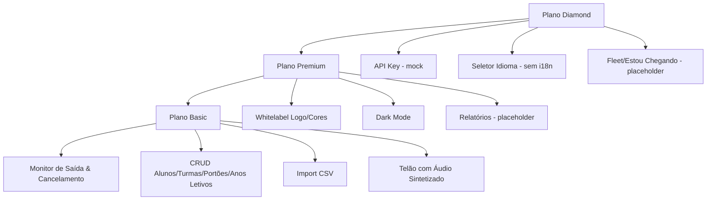

# Funcionalidades — Smart Exit School

Mapeamento completo do estado atual, organizado por perfil de usuário.

---

## Super Admin (AllTech Solutions)

**Rota:** `/admin/institutions`  
**Autenticação:** Supabase Auth + `is_platform_admin()`. Platform Admin não é tenant de escola.  
**Proteção de Rota:** Protegido via `usePlatformAdmin()` (`PlatformAdminGate`), restringindo o acesso exclusivamente a Platform Admins autenticados.

### Implementadas

| Funcionalidade | Descrição | Arquivo |
|----------------|-----------|---------|
| Guard de rota (`/admin/institutions`) | Proteção estrita via `usePlatformAdmin()` (redireciona não-admins) | `PlatformAdminGate.jsx` |
| Dashboard de métricas | Total escolas, ativas, alunos gerenciados | `InstitutionsManager.jsx` |
| Listagem de instituições | Tabela com nome, e-mail, plano, alunos, status | `InstitutionsManager.jsx` |
| Busca de instituições | Por nome ou e-mail | `InstitutionsManager.jsx` |
| Criar instituição | Modal com nome e plano; nome obrigatório e único no Supabase; feedback visual `Salvando...` | `InstitutionsManager.jsx` |
| Editar instituição | Modal pré-preenchido; validação de unicidade de nome e persistência de alteração de plano | `InstitutionsManager.jsx` |
| Excluir instituição | Com confirmação explícita | `InstitutionsManager.jsx` |
| Suspender/Reativar | Toggle status Ativo/Inativo | `InstitutionsManager.jsx` |
| Logout | Encerra sessão Auth e navega para `/login` | `InstitutionsManager.jsx` |
| Catálogo global de usuários | ✅ Super Admin busca usuários por nome, e-mail e instituição via RPC `list_platform_users` | `InstitutionsManager.jsx`, `platformAdminService.js` |
| Impersonar escola (login como usuário) | ✅ Super Admin acessa conta de usuário-alvo via impersonation auditada, com JWT manual, sentinela anti-refresh, TTL 45min e trilha imutável em `impersonation_audit_logs` | `InstitutionsManager.jsx`, Edge Functions `impersonate-user` / `end-impersonation` |
| Banner de suporte (Impersonation) | ✅ Componente `SupportBanner` com identificação visual, contador regressivo de 45min e botão de encerramento seguro | `SupportBanner.jsx` |
| Logs de auditoria | ✅ Tabela `public.impersonation_audit_logs` com snapshots imutáveis de e-mail/nome, constraints de validação, RLS restritivo e testes de segurança (Grupos A/B) | `impersonation_audit_logs`, Edge Functions |
| Migração plano Pro → Basic | Automática no load | `InstitutionsManager.jsx` |

### Incompletas / Ausentes

| Funcionalidade | Status |
|----------------|--------|
| Billing / faturamento | **Não identificado** |
| Gestão de planos Trial (expiração 14 dias) | Plano existe no select; **lógica ausente** |

---

## Operador da escola (Painel institucional)

**Rota:** `/painel`  
**Autenticação:** Supabase Auth e membership ativa em `public.school_members`. `localStorage` não autoriza. Em produção, uma conta escolar de teste já abriu `/painel` para o Colégio Adventista de Esteio. Ver [autenticacao.md](autenticacao.md).  
**Proteção de Rota:** Protegido via `TenantPanelGate`, validando sessão ativa no Supabase Auth e membership ativa no tenant escolar correspondente.  
**Domínio e Persistência:** Gestão institucional completa conectada ao Supabase PostgreSQL: níveis acadêmicos (`academic_levels`), turmas (`academic_groups`), anos letivos (`school_years`), alunos (`students`), matrículas (`student_enrollments`, `student_group_assignments`), portões (`public.gates`) e chamadas de saída (`public.pickup_events`).

### Aba: Monitor de Saída ✅

| Funcionalidade | Status |
|----------------|--------|
| Fonte da verdade de chamadas | ✅ `public.pickup_events` é a fonte oficial da fila operacional |
| Listar alunos disponíveis | ✅ Aluno com chamada `called` sai da lista |
| Buscar por nome ou turma | ✅ |
| Selecionar portão por aluno | ✅ Seleção gravada diretamente em `public.pickup_events` (`gate_id`) |
| Chamar aluno | ✅ Insere `pickup_events` com status `called` |
| Cancelamento de chamadas | ✅ Operador pode cancelar chamada acionada, preenchendo `cancelled_at` e registrando justificativa via modal (`pickupService.cancelCall`) |
| Fila de chamada com horário | ✅ `called_at`, mais recente primeiro, lido de `public.pickup_events` |
| Confirmar saída | ✅ Atualiza para `completed` em `public.pickup_events`; o registro histórico permanece |
| Abrir telão em nova aba | ✅ |
| Impedir chamada duplicada | ✅ Lista ativa + índice único por matrícula no banco (`pickup_events_active_enrollment_unique`) |

### Aba: Anos Letivos ✅

| Funcionalidade | Status |
|----------------|--------|
| Ano letivo configurável | ✅ Cada tenant possui tabela `public.school_years` com alternância atômica do ano letivo ativo via RPC `activate_school_year` |
| Gestão de datas | ✅ Validação de intervalo (`start_date`, `end_date`) e restrição de sobreposição |
| Vinculação de matrículas | ✅ Matrículas e turmas acadêmicas associadas explicitamente ao ano letivo ativo |

### Aba: Gestão de Alunos ✅

| Funcionalidade | Status |
|----------------|--------|
| Persistência relacional | ✅ Dados persistidos no PostgreSQL (`students` e `student_enrollments`) via DAL |
| Cadastrar aluno | ✅ |
| Editar aluno | ✅ |
| Excluir aluno | ✅ |
| Vincular turma | ✅ Vínculo formal em `public.student_group_assignments` |
| Definir saída padrão | ✅ |
| Herdar saída da turma | ✅ |
| Seleção em massa (checkbox) | ✅ |
| Alteração em massa (turma/saída) | ✅ |
| Contador de alunos | ✅ |

### Aba: Gestão de Turmas ✅

| Funcionalidade | Status |
|----------------|--------|
| Persistência relacional | ✅ Dados persistidos no PostgreSQL (`academic_levels` e `academic_groups`) via DAL |
| Cadastrar turma | ✅ |
| Editar turma | ✅ |
| Excluir turma | ✅ |
| Definir saída padrão da turma | ✅ |
| Propagação ao renomear turma | ✅ |
| Edição em massa de turmas | ⚠️ Lógica existe; **UI ausente** |

### Aba: Gestão de Portões ✅

| Funcionalidade | Status |
|----------------|--------|
| Fonte da verdade | ✅ `public.gates` (vertical fechada e verificada em produção via `gateService`) |
| CRUD portões avançados (nome, horário) | ✅ |
| Vincular turmas como saída padrão | ✅ |
| Propagação para alunos | ✅ |
| CRUD `school.exits` (legado) | ⚠️ Handlers existem; **UI não exposta** |
| Uso de `gates` no monitor | ✅ Seletor usa `gate.id` dos portões ativos em `public.gates` |

### Aba: Importar Dados ✅

| Funcionalidade | Status |
|----------------|--------|
| Upload CSV | ✅ |
| Criação automática de turmas | ✅ |
| Detecção de duplicatas | ✅ |
| Encoding windows-1252 | ✅ |

### Aba: Relatórios Avançados 🔒 / 🚧

| Plano | Comportamento |
|-------|---------------|
| Basic | Tela de upgrade (bloqueado) |
| Premium/Diamond | Placeholder: "Em breve: Gráficos e inteligência de dados" |

**Funcionalidade incompleta** — apenas UI de bloqueio/placeholder.

### Aba: Rotas & "Estou Chegando" 🔒 / 🚧

| Plano | Comportamento |
|-------|---------------|
| Basic/Premium | Tela de upgrade Diamond |
| Diamond | Placeholder: "Em breve: Painel de monitoramento..." |

**Funcionalidade incompleta** — geolocalização e app dos pais não implementados.

### Aba: Configurações ⚠️

| Funcionalidade | Plano | Status |
|----------------|-------|--------|
| Visualizar dados cadastrais | Todos | ✅ (readonly) |
| Upload logo customizado | Premium+ | ✅ |
| Remover logo | Premium+ | ✅ |
| Cores whitelabel | Premium+ | ✅ |
| Restaurar cores padrão | Premium+ | ✅ |
| Dark mode toggle | Premium+ | ✅ |
| Seletor de idioma | Diamond | ✅ (salva; **não traduz UI**) |
| Gerar API Key | Diamond | ✅ (não consumida) |
| Reset de fábrica | Todos | ✅ |

### Autenticação & Recuperação de Senha ✅

| Funcionalidade | Status |
|----------------|--------|
| Login com e-mail/senha | ✅ Supabase Auth com suporte a toggle de visualização (`PasswordInput`) |
| Recuperação de senha (`/forgot-password`) | ✅ Envio de e-mail de redefinição integrado ao Supabase Auth / SMTP Brevo |
| Redefinição de senha (`/update-password`) | ✅ Atualização atômica de senha com token de recuperação |
| Logout | ✅ Encerra a sessão Auth e limpa caches de tenant |

---

## Público / Telão

**Rota:** `/tv`  
**Acesso:** Rota pública de telão para exibição de chamadas em tempo real.  
**Fonte de Dados:** `public.pickup_events` lida a cada 5s (polling operacional).

| Funcionalidade | Status |
|----------------|--------|
| Exibir chamada atual | ✅ Primeira chamada ativa (`called`) de `public.pickup_events` |
| Exibir chamadas recentes | ✅ Demais chamadas ativas da fila `called` |
| Relógio e data (pt-BR) | ✅ |
| Sincronização da fila | ✅ Polling a cada 5 segundos contra `public.pickup_events`; sem Realtime |
| Fullscreen (clique no header) | ✅ |
| Whitelabel (logo/cores) | ✅ Premium/Diamond |
| Dark mode | ✅ (lê `@SmartExit:darkMode`) |
| Áudio no telão | ✅ Anúncio sonoro inteligente: chime harmônico (Web Audio API) + síntese de voz (Web Speech API), fila sequencial e debounce |

---

## Responsáveis (pais)

**Não identificado no código.**

Mencionado apenas em copy de marketing na aba Fleet (Diamond):

> "integração com o app dos pais para organizar a fila da chamada antes mesmo deles chegarem no portão"

Não há portal do responsável, app mobile ou autorização de retirada ativa.

---

## Alunos

**Não identificado como perfil autenticado.**

Alunos existem apenas como registros de dados gerenciados pelo operador da escola (persistidos em `public.students` e `public.student_enrollments` via DAL). Não há login ou interface para alunos.

---

## Funcionalidades experimentais / legado

| Item | Descrição |
|------|-----------|
| `StudentCard.jsx` | Componente de card com foto — mantido para futura integração visual |
| `students.js` | Mock inicial com alunos de demonstração |
| `App.css` | Estilos template Vite |
| `school.exits` (legado) | Modelo textual substituído por `public.gates` |

---

## Funcionalidades premium (por plano)

```mermaid
graph TD
    Basic[Plano Basic]
    Premium[Plano Premium]
    Diamond[Plano Diamond]

    Basic --> Monitor[Monitor de Saída & Cancelamento]
    Basic --> CRUD[CRUD Alunos/Turmas/Portões/Anos Letivos]
    Basic --> Import[Import CSV]
    Basic --> TV[Telão com Áudio Sintetizado]

    Premium --> Basic
    Premium --> WL[Whitelabel Logo/Cores]
    Premium --> DM[Dark Mode]
    Premium --> Reports[Relatórios - placeholder]

    Diamond --> Premium
    Diamond --> API[API Key - mock]
    Diamond --> Lang[Seletor Idioma - sem i18n]
    Diamond --> Fleet[Fleet/Estou Chegando - placeholder]
```

---

## Matriz resumida por perfil

| Capacidade | Super Admin | Operador Escola | Telão | Responsável | Aluno |
|------------|:-----------:|:---------------:|:-----:|:-----------:|:-----:|
| Login | ✅ | ✅ | — | ❌ | ❌ |
| Catálogo global de usuários | ✅ | ❌ | ❌ | ❌ | ❌ |
| Impersonation auditada | ✅ | ❌ | ❌ | ❌ | ❌ |
| CRUD instituições | ✅ | ❌ | ❌ | ❌ | ❌ |
| CRUD alunos/turmas | ❌ (direto) / ✅ (impersonado) | ✅ | ❌ | ❌ | ❌ |
| Anos letivos configuráveis | ❌ (direto) / ✅ (impersonado) | ✅ | ❌ | ❌ | ❌ |
| Chamar alunos | ❌ (direto) / ✅ (impersonado) | ✅ | ❌ | ❌ | ❌ |
| Cancelar chamadas | ❌ (direto) / ✅ (impersonado) | ✅ | ❌ | ❌ | ❌ |
| Ver chamadas | ❌ (direto) / ✅ (impersonado) | ✅ | ✅ | ❌ | ❌ |
| Configurar whitelabel | ❌ (direto) / ✅ (impersonado) | ✅* | — | ❌ | ❌ |

\* Premium/Diamond apenas
