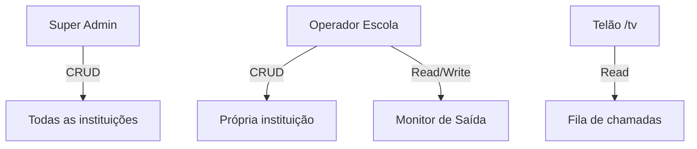

# Permissões — Smart Exit School

## Perfis identificados

| Perfil | Identificação | Autenticação |
|--------|---------------|--------------|
| **Super Admin** | E-mail `admin@alltech.com` | Hardcoded |
| **Operador da escola** | Qualquer registro em `@SmartExit:schools` | E-mail + senha |
| **Telão (anônimo)** | Sem login | Acesso público à rota `/tv` |
| **Responsável / Aluno** | — | **Não identificado** |

Não há sistema de RBAC (Role-Based Access Control) granular. Permissões derivam do **plano da instituição** (`plan`) e do **perfil de acesso** (admin vs escola).

---

## Papéis e níveis de acesso



---

## Matriz: Super Admin vs Operador

| Funcionalidade | Super Admin | Operador Escola |
|----------------|:-----------:|:---------------:|
| Criar/editar/excluir instituições | ✅ | ❌ |
| Alterar plano | ✅ | ❌ |
| Suspender instituição | ✅ | ❌ |
| Ver dashboard global | ✅ | ❌ |
| CRUD alunos | ❌ | ✅ |
| CRUD turmas | ❌ | ✅ |
| CRUD portões | ❌ | ✅ |
| Chamar alunos | ❌ | ✅ |
| Import CSV | ❌ | ✅ |
| Whitelabel | ❌ | ✅* |
| Configurações | ❌ | ✅ |
| Reset de fábrica | ❌ | ✅ |
| Abrir telão | ❌ | ✅ |

\* Conforme plano — ver seção Planos

---

## Planos e restrições

### Plano Basic

| Recurso | Acesso |
|---------|--------|
| Monitor de Saída | ✅ |
| Gestão de Alunos | ✅ |
| Gestão de Turmas | ✅ |
| Gestão de Portões | ✅ |
| Importar Dados | ✅ |
| Configurações (dados cadastrais) | ✅ Leitura |
| Relatórios Avançados | 🔒 Bloqueado — tela upgrade |
| Rotas & Estou Chegando | 🔒 Bloqueado — tela upgrade |
| Whitelabel (logo/cores) | 🔒 Overlay bloqueio |
| Dark mode | 🔒 Bloqueado |
| API Key / Idioma | 🔒 Bloqueado (overlay Diamond) |
| Nome/logo exibidos | AllTech Solutions (marca plataforma) |

### Plano Premium

| Recurso | Acesso |
|---------|--------|
| Tudo do Basic | ✅ |
| Whitelabel (logo + cores) | ✅ |
| Dark mode | ✅ |
| Relatórios Avançados | ⚠️ Menu desbloqueado; conteúdo placeholder |
| Rotas & Estou Chegando | 🔒 Bloqueado — upgrade Diamond |
| API Key / Idioma avançado | 🔒 Overlay Diamond |
| Nome/logo exibidos | Nome e logo da escola |

### Plano Diamond

| Recurso | Acesso |
|---------|--------|
| Tudo do Premium | ✅ |
| Rotas & Estou Chegando | ⚠️ Menu desbloqueado; conteúdo placeholder |
| API Key | ✅ Geração local |
| Seletor de idioma | ✅ Salva preferência (sem tradução) |
| Webhooks | 🔒 Mencionado na UI; **não implementado** |

### Plano Trial

| Recurso | Acesso |
|---------|--------|
| Comportamento no painel | **Não diferenciado** — tratado como string de plano |
| Expiração 14 dias | **Não implementada** |

---

## Implementação técnica das restrições

### Menu lateral (ícone cadeado)

```javascript
// InstitutionPanel.jsx
{ id: "reports", locked: school.plan === "Basic" },
{ id: "fleet", locked: school.plan === "Basic" || school.plan === "Premium" },
```

Itens com `locked` exibem ícone `Lock` mas **permanecem clicáveis**.

### Whitelabel

```javascript
school.plan !== "Basic" && school.customLogo  // exibe logo custom
school.plan !== "Basic" && school.name        // exibe nome escola
(school.plan === "Premium" || school.plan === "Diamond")  // cores custom
```

### Dark mode

```javascript
school.plan === "Basic" ? <Lock /> : <Toggle />
```

### API / Idioma

```javascript
["Basic", "Premium"].includes(school.plan)  // overlay bloqueio
```

### Telão

```javascript
const isPremium = plan === "premium" || plan === "diamond"  // case insensitive
// Avatar e logo custom apenas se isPremium
```

---

## Restrições operacionais

| Regra | Descrição |
|-------|-----------|
| Isolamento de dados | Por `school.id` nas chaves localStorage |
| Chamada única | Aluno não pode estar duplicado na fila |
| Dados cadastrais | Nome/e-mail escola readonly no painel — "contate suporte" |
| Instituição inativa | Status alterável pelo admin; **login não bloqueado** |
| Reset de fábrica | Disponível a qualquer operador logado — apaga tudo |

---

## Funcionalidades permitidas por perfil (resumo)

### Super Admin

- Gestão completa do tenant (instituições)
- Métricas agregadas
- Sem acesso ao monitor operacional das escolas

### Operador Escola

- Operação diária de saída de alunos
- Cadastros pedagógicos (alunos, turmas)
- Configuração local (conforme plano)
- Reset destrutivo do sistema

### Telão

- Somente leitura da fila de chamadas
- Sem interação de confirmação de saída

---

## Pontos que precisam de validação

- Permissões diferenciadas dentro da escola (coordenador vs portaria)
- Comportamento do plano Trial após 14 dias
- Se menu bloqueado deve impedir navegação ou apenas indicar visualmente
- Enforcement de status Inativo no login
- Permissões do telão sem sessão ativa (modo kiosk)
