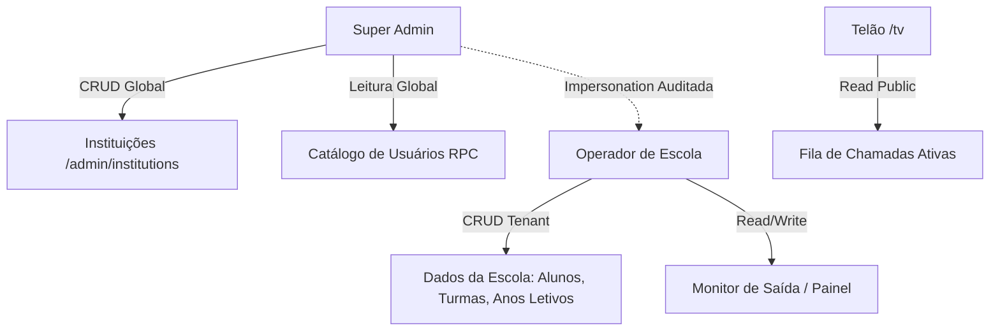

# Permissões — Smart Exit School

## Perfis identificados

| Perfil | Identificação | Autenticação & Mecanismo | Escopo e Acesso Operacional |
|--------|---------------|--------------------------|-----------------------------|
| **Platform Admin (Super Admin)** | RPC `is_platform_admin()` | Supabase Auth; fluxo `/admin/institutions`; não é tenant | Gestão global de instituições, catálogo de usuários e suporte técnico via impersonation |
| **Operador de Escola** | Membership ativa em `school_members` | Supabase Auth (`auth.uid()`) | Operação diária da unidade escolar vinculada (alunos, turmas, chamadas, anos letivos) |
| **Operador Impersonado** | JWT manual assinado (HS256) | Edge Function `impersonate-user`; token temporário auditado | Acesso em primeira pessoa ao painel do operador-alvo com isolamento RLS de tenant; sem privilégio de plataforma |
| **Telão (anônimo)** | Sem login | Acesso público à rota `/tv`; não autoriza tenant | Fila de chamadas da escola via cache de exibição |
| **Responsável / Aluno** | — | **Não identificado** | Notificações passivas no portão |

Não há sistema de RBAC granular customizável na interface. Permissões de tela derivam do **plano da instituição** (`plan`) e do **perfil de acesso** (Platform Admin vs usuário de escola).

O catálogo `public.roles` contém `owner`, `administrator`, `secretary` e `gatekeeper`. Em produção, essas quatro roles foram inseridas no schema. A policy de `UPDATE` em `schools` reconhece membros ativos `owner` ou `administrator`. O login do operador resolve o tenant a partir de qualquer membership `active` em `school_members`.

---

## Papéis e níveis de acesso


```mermaid
graph TD
    SA[Super Admin] --> |CRUD Global| Schools[Instituições /admin/institutions]
    SA --> |Leitura Global| Users[Catálogo de Usuários RPC]
    SA -.-> |Impersonation Auditada| OP[Operador de Escola]
    OP --> |CRUD Tenant| OwnData[Dados da Escola: Alunos, Turmas, Anos Letivos]
    OP --> |Read/Write| Monitor[Monitor de Saída / Painel]
    TV[Telão /tv] --> |Read Public| Calls[Fila de Chamadas Ativas]
```

---

## Matriz: Super Admin vs Operador de Escola

| Funcionalidade | Super Admin (Direto) | Super Admin (via Impersonation) | Operador Escola |
|----------------|:--------------------:|:--------------------------------:|:---------------:|
| Criar/editar/suspender instituições | ✅ | ❌ | ❌ |
| Alterar plano de escola | ✅ | ❌ | ❌ |
| Dashboard global de instituições | ✅ | ❌ | ❌ |
| Catálogo global de usuários (`list_platform_users`) | ✅ | ❌ | ❌ |
| Iniciar / encerrar Impersonation | ✅ | ❌ | ❌ |
| Operar saída de alunos (chamar) | ❌ | ✅ | ✅ |
| Cancelar chamadas de saída (`cancelled_at`) | ❌ | ✅ | ✅ |
| Gerenciar Anos Letivos (`activate_school_year`) | ❌ | ✅ | ✅ |
| CRUD alunos e turmas | ❌ | ✅ | ✅ |
| CRUD portões escolares | ❌ | ✅ | ✅ |
| Import CSV de turmas/alunos | ❌ | ✅ | ✅ |
| Configurações pedagógicas e de telão | ❌ | ✅ | ✅ |
| Whitelabel (logo/cores) | ❌ | ✅* | ✅* |
| Reset de dados da escola | ❌ | ✅ | ✅ |
| Abrir telão (`/tv`) | ❌ | ✅ | ✅ |

\* Conforme plano contratado pela escola — ver seção Planos.

---

## Proteções de Não-Escalonamento e Garantias de Segurança

O acesso do Super Admin ao domínio operacional da escola ocorre exclusivamente através de **Impersonation User-Level**, protegida por rigorosas invariantes de segurança validadas na suíte [impersonationSecurityAudit.test.js](file:///c:/github_projects/smart-exit-school/src/services/impersonationSecurityAudit.test.js):

### Garantias Comprovadas por Testes Automatizados (Grupos A e B)

1. **Não-escalonamento de Privilégio:**
   - O token de impersonation é gerado com claim `role: 'authenticated'` e `sub: target_user_id`.
   - O token impersonado **NÃO** possui autoridade de plataforma (`is_platform_admin() = false`).
   - Tentativa de chamar a RPC `list_platform_users` com o token impersonado falha com **Erro 42501 (Access denied)**.
   - Tentativa de consultar a tabela `public.platform_admins` com o token impersonado retorna **0 linhas** (bloqueio soberano por RLS).
2. **Preservação do Isolamento de Tenant:**
   - As consultas realizadas durante a impersonation são avaliadas pelo PostgreSQL sob o identificador do usuário-alvo (`auth.uid()`).
   - A RLS de tenant permanece 100% ativa: o admin impersonado só enxerga os dados da escola autorizada para o usuário-alvo. O acesso a dados de qualquer outro tenant retorna 0 linhas.
3. **Imutabilidade da Auditoria:**
   - O token de impersonation não possui privilégios de `INSERT`, `UPDATE` ou `DELETE` na tabela `public.impersonation_audit_logs`. Tentativas diretas de adulteração são bloqueadas pelo banco.
   - A criação e encerramento de logs ocorrem exclusivamente via Edge Functions protegidas executando sob contexto privilegiado com validação do chamador.
4. **Anti-Renovação e TTL Estrito:**
   - A Edge Function emite o token sem refresh token de GoTrue (`refresh_token: 'impersonation_no_refresh'`).
   - O SDK cliente executa `supabase.auth.stopAutoRefresh()` para garantir que o token expire deterministicamente após 45 minutos (2700 segundos), encerrando a sessão de suporte e evitando permanência indevida.
5. **Restauração Segura:**
   - Ao encerrar a impersonation, o cliente restaura os tokens originais do Platform Admin a partir de `sessionStorage`, limpa os caches de tenant em memória e reativa `supabase.auth.startAutoRefresh()`.

---

## Planos e restrições

### Plano Basic

| Recurso | Acesso |
|---------|--------|
| Monitor de Saída & Cancelamento de Chamadas | ✅ |
| Gestão de Alunos, Turmas e Anos Letivos | ✅ |
| Gestão de Portões | ✅ |
| Importar Dados | ✅ |
| Configurações (dados cadastrais) | ✅ Leitura |
| Relatórios Avançados | 🔒 Bloqueado — tela upgrade |
| Rotas & Estou Chegando | 🔒 Bloqueado — tela upgrade |
| Whitelabel (logo/cores) | 🔒 Overlay bloqueio |
| Dark mode | 🔒 Bloqueado |
| API Key / Idioma | 🔒 Bloqueado (overlay Diamond) |
| Nome/logo exibidos | AllTech Solutions (marca plataforma) |

### Plano Premium

| Recurso | Acesso |
|---------|--------|
| Tudo do Basic | ✅ |
| Whitelabel (logo + cores) | ✅ |
| Dark mode | ✅ |
| Relatórios Avançados | ⚠️ Menu desbloqueado; conteúdo informativo |
| Rotas & Estou Chegando | 🔒 Bloqueado — upgrade Diamond |
| API Key / Idioma avançado | 🔒 Overlay Diamond |
| Nome/logo exibidos | Nome e logo da escola |

### Plano Diamond

| Recurso | Acesso |
|---------|--------|
| Tudo do Premium | ✅ |
| Rotas & Estou Chegando | ⚠️ Menu desbloqueado; conteúdo informativo |
| API Key | ✅ Geração local |
| Seletor de idioma | ✅ Salva preferência |
| Webhooks | 🔒 Mencionado na UI; em desenvolvimento |

### Plano Trial

| Recurso | Acesso |
|---------|--------|
| Comportamento no painel | **Não diferenciado** — tratado como string de plano |
| Expiração 14 dias | Controlada administrativamente |

---

## Implementação técnica das restrições

### Menu lateral (ícone cadeado)

```javascript
// InstitutionPanel.jsx
{ id: "reports", locked: school.plan === "Basic" },
{ id: "fleet", locked: school.plan === "Basic" || school.plan === "Premium" },
```

Itens com `locked` exibem ícone `Lock` mas permanecem navegáveis com modal informativo de upgrade.

### Whitelabel

```javascript
school.plan !== "Basic" && school.customLogo  // exibe logo custom
school.plan !== "Basic" && school.name        // exibe nome escola
(school.plan === "Premium" || school.plan === "Diamond")  // cores custom
```

### Dark mode

```javascript
school.plan === "Basic" ? <Lock /> : <Toggle />
```

### API / Idioma

```javascript
["Basic", "Premium"].includes(school.plan)  // overlay bloqueio
```

### Telão

```javascript
const isPremium = plan === "premium" || plan === "diamond"  // case insensitive
// Avatar e logo custom apenas se isPremium
```

---

## Restrições operacionais

| Regra | Descrição |
|-------|-----------|
| Isolamento de dados no banco | RLS soberana sobre `school_members`; `localStorage` não autoriza |
| Chamada única ativa | Aluno com status `called` não pode sofrer nova chamada até conclusão ou cancelamento |
| Cancelamento de chamada | Operador pode cancelar evento de saída com gravação em `cancelled_at` |
| Dados cadastrais da escola | Nome/e-mail escola readonly no painel — alteração restrita ao Super Admin |
| Instituição inativa | Status gerenciado pelo Platform Admin; impede acesso operacional |
| Reset de dados da escola | Operação de limpeza restrita a operadores autenticados no tenant |

---

## Funcionalidades permitidas por perfil (resumo)

### Super Admin (Platform Admin)

- Gestão completa do tenant e catálogo de instituições (`/admin/institutions`)
- Catálogo global de usuários (`public.list_platform_users`)
- Acesso ao domínio operacional de escolas **exclusivamente via Impersonation User-Level** controlada, temporária (45 min) e auditada (não por credencial direta compartilhada)
- Métricas agregadas de plataforma

### Operador Escola

- Operação diária de saída de alunos (chamada, fila, cancelamento)
- Gestão de ciclos e anos letivos (`public.school_years`, `activate_school_year`)
- Cadastros pedagógicos (alunos, turmas, matrículas)
- Configuração local de portões e painel (conforme plano)

### Telão

- Somente leitura da fila de chamadas em tempo real
- Sem interação de confirmação ou alteração de dados
