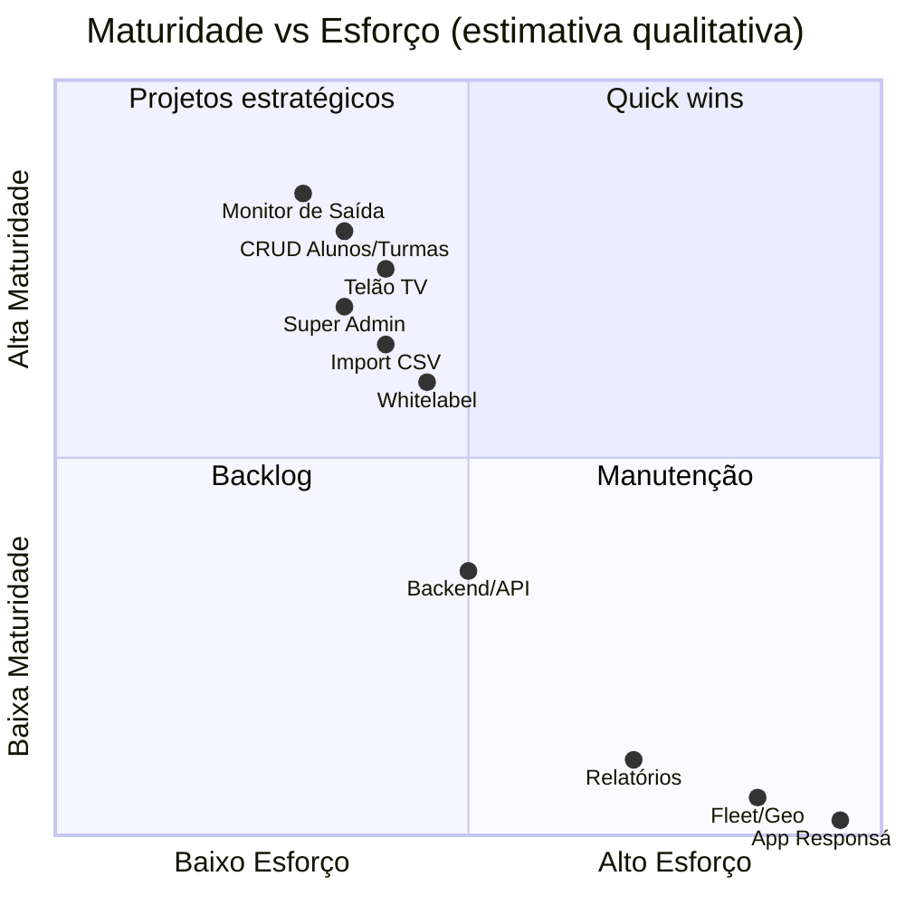

# Roadmap — Smart Exit School

Evoluções identificadas com base em placeholders de UI, código parcialmente implementado, comentários e lacunas arquiteturais. **Nenhum item abaixo está comprometido** — reflete apenas o que o código sugere ou omite.

---

## Curto prazo

Itens com base existente no código que precisam de conclusão ou correção.

| Item | Evidência | Prioridade sugerida |
|------|-----------|---------------------|
| Unificar `school.exits` e `gatesList` | Dois sistemas de portão sem sync | Alta |
| Expor UI para CRUD de `school.exits` | Handlers `handleAddExit`/`handleRemoveExit` sem UI | Alta |
| UI bulk edit para turmas | Funções existem; interface ausente | Média |
| Route guard Super Admin | `/admin/institutions` desprotegida | Alta |
| Bloquear login instituição Inativa | Status existe; não enforced | Alta |
| Remover código morto | `StudentCard`, `students.js`, `App.css`, `call.mp3` | Baixa |
| Reproduzir som de chamada | `public/sounds/call.mp3` existe | Média |
| Corrigir chaves legado | `institutions`, `currentUser` | ✅ Removido na Fase 1 DAL | — |
| Sincronizar telão mesma aba | Depende de polling 2s | Baixa |

---

## Médio prazo

Funcionalidades com placeholder "Em breve" ou menção explícita na UI.

| Item | Evidência | Plano |
|------|-----------|-------|
| Relatórios avançados | "Em breve: Gráficos e inteligência de dados" | Premium+ |
| Histórico de saídas confirmadas | Chamadas removidas sem persistência | Premium+ |
| Internacionalização (i18n) | Seletor idioma Diamond; UI fixa PT | Diamond |
| API REST funcional | API Key gerada; sem endpoints | Diamond |
| Webhooks | Mencionado em Configurações Diamond | Diamond |
| Lógica plano Trial (14 dias) | Option no select admin | Trial |
| Completar migração Supabase (Fase 2) | `schoolService` híbrido; demais services em localStorage | Todos |
| Supabase Auth no frontend (ADR-004) | Login ainda legado | Todos |
| RLS e políticas de acesso | Migrations sem RLS | Todos |
| Migration Pickup Core (gates, calls) | Domínio operacional ainda em localStorage | Todos |
| Mapeamento planos UI ↔ DB | Basic/Premium/Diamond vs basic/pro/enterprise | Todos |
| Autenticação segura | Senhas plaintext, admin hardcoded | Todos |
| Testes automatizados | Ausentes | Todos |
| CI/CD pipeline | Ausente | Todos |

---

## Longo prazo

Visão de produto inferida de copy de marketing no código.

| Item | Evidência |
|------|-----------|
| App para responsáveis ("Estou Chegando") | Copy aba Fleet Diamond |
| Geolocalização de pais | Copy aba Fleet |
| Gestão de vans/frotas escolares | Copy aba Fleet |
| Fila organizada antes da chegada | Copy upgrade Diamond |
| Integração pagamentos/billing | SaaS multi-plano sem billing |
| Notificações push | Não mencionado tecnicamente |
| Portal self-service para escolas | Alteração dados "contate suporte" |
| Multi-usuário por escola (RBAC) | Apenas um login por instituição |
| Auditoria e logs centralizados | Não identificado |
| App mobile nativo | Não identificado |

---

## Diagrama de maturidade

---

## TODOs explícitos no código-fonte

| Local | Conteúdo | Tipo |
|-------|----------|------|
| `Login.jsx:33` | Comentário "configuração no futuro" | Comentário |
| `InstitutionPanel.jsx` reports | "Em breve: Gráficos..." | Placeholder UI |
| `InstitutionPanel.jsx` fleet | "Em breve: Painel de monitoramento..." | Placeholder UI |
| `App.jsx:15` | Comentário sobre cores no InstitutionPanel | Comentário |

**Nenhum `TODO`/`FIXME` formal** encontrado em arquivos do projeto (excluindo node_modules).

---

## Pontos que precisam de validação humana

- Priorização oficial do backlog
- Decisão build vs buy para backend
- Escopo MVP produção vs protótipo demo
- Prazo e escopo do plano Trial
- Integração com sistemas existentes das escolas (TOTVS, Sophia, etc.)
