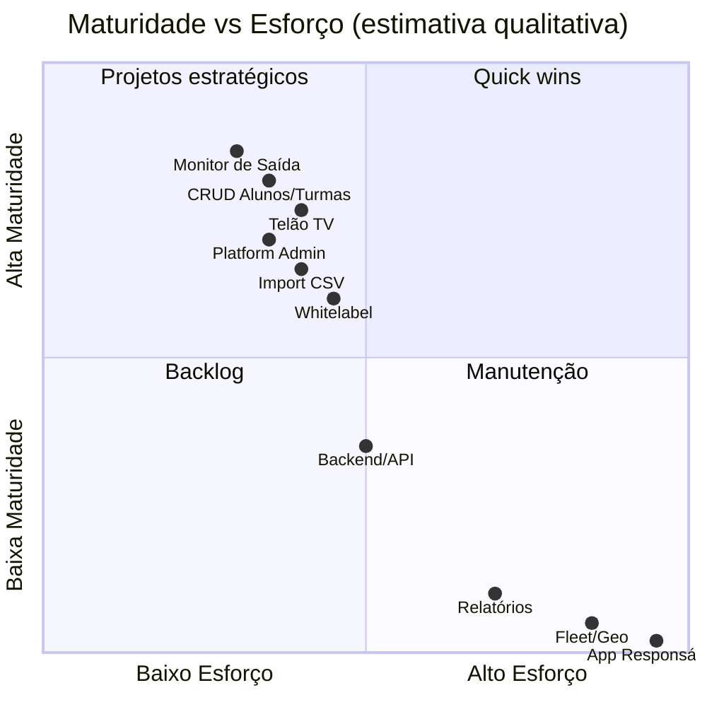

# Roadmap — Smart Exit School

Evoluções identificadas com base em placeholders de UI, código parcialmente implementado, comentários e lacunas arquiteturais. **Nenhum item abaixo está comprometido** — reflete apenas o que o código sugere ou omite.

---

## Curto prazo

Itens com base existente no código que precisam de conclusão ou correção.

| Item | Evidência | Prioridade sugerida |
|------|-----------|---------------------|
| Unificar `school.exits` e `gatesList` | Dois sistemas de portão sem sync | Alta |
| Expor UI para CRUD de `school.exits` | Handlers `handleAddExit`/`handleRemoveExit` sem UI | Alta |
| UI bulk edit para turmas | Funções existem; interface ausente | Média |
| Route guard Platform Admin | Guard via `usePlatformAdmin` em `InstitutionsManager` | ✅ Implementado |
| Bloquear login instituição Inativa | Status existe; não enforced | Alta |
| Remover código morto | `StudentCard`, `students.js`, `App.css`, `call.mp3` | Baixa |
| Reproduzir som de chamada | `public/sounds/call.mp3` existe | Média |
| Corrigir chaves legado | `institutions`, `currentUser` | ✅ Removido na Fase 1 DAL | — |
| Sincronizar telão mesma aba | Depende de polling 2s | Baixa |

---

## Médio prazo

Funcionalidades com placeholder "Em breve" ou menção explícita na UI.

| Item | Evidência | Plano |
|------|-----------|-------|
| Relatórios avançados | "Em breve: Gráficos e inteligência de dados" | Premium+ |
| Histórico de saídas confirmadas | Chamadas removidas sem persistência | Premium+ |
| Internacionalização (i18n) | Seletor idioma Diamond; UI fixa PT | Diamond |
| API REST funcional | API Key gerada; sem endpoints | Diamond |
| Webhooks | Mencionado em Configurações Diamond | Diamond |
| Lógica plano Trial (14 dias) | Option no select admin | Trial |
| Completar migração Supabase (Fase 2) | Catálogo `schools` já no Supabase; `gateService`/`callService` ainda em localStorage apesar do schema Pickup Core | Todos |
| Integrar Pickup Core no frontend | Migrations 0004 (`gates`, `pickup_events`) no banco; services do painel ainda usam localStorage | Todos |
| Login tenant via Auth/membership | Platform Admin ✅; Auth Tenant 🚧 (ADR-029) | Todos |
| RLS tenant + Platform Admin | Foundation 0005 + policies Platform em `schools`/`platform_admins` (0007–0012); painel operacional ainda não consome RLS | Todos |
| Mapeamento planos UI ↔ DB | Basic/Premium/Diamond vs basic/pro/enterprise (adapters no `schoolService`) | Todos |
| Autenticação tenant segura | Ver seção Auth Tenant abaixo | Todos |
| Testes automatizados | Ausentes | Todos |
| CI/CD pipeline | Ausente | Todos |

---

## Longo prazo

Visão de produto inferida de copy de marketing no código.

| Item | Evidência |
|------|-----------|
| App para responsáveis ("Estou Chegando") | Copy aba Fleet Diamond |
| Geolocalização de pais | Copy aba Fleet |
| Gestão de vans/frotas escolares | Copy aba Fleet |
| Fila organizada antes da chegada | Copy upgrade Diamond |
| Integração pagamentos/billing | SaaS multi-plano sem billing |
| Notificações push | Não mencionado tecnicamente |
| Portal self-service para escolas | Alteração dados "contate suporte" |
| Multi-usuário por escola (RBAC) | Apenas um login por instituição |
| Auditoria e logs centralizados | Não identificado |
| App mobile nativo | Não identificado |

---

## Diagrama de maturidade

```mermaid
quadrantChart
    title Maturidade vs Esforço (estimativa qualitativa)
    x-axis Baixo Esforço --> Alto Esforço
    y-axis Baixa Maturidade --> Alta Maturidade
    quadrant-1 Quick wins
    quadrant-2 Projetos estratégicos
    quadrant-3 Backlog
    quadrant-4 Manutenção

    Monitor de Saída: [0.3, 0.85]
    CRUD Alunos/Turmas: [0.35, 0.8]
    Telão TV: [0.4, 0.75]
    Whitelabel: [0.45, 0.6]
    Platform Admin: [0.35, 0.7]
    Import CSV: [0.4, 0.65]
    Backend/API: [0.5, 0.35]
    App Responsáveis: [0.95, 0.02]
    Relatórios: [0.7, 0.1]
    Fleet/Geo: [0.85, 0.05]
```

---

## Auth Tenant

| Camada | Status |
|--------|--------|
| Platform Admin (Auth + `platform_admins` + RPC) | ✅ |
| Auth Tenant (operadores da instituição) | 🚧 |

### Planejado (ADR-029)

- Supabase Auth
- `school_members`
- `roles`
- RLS por membership
- Remoção completa da sessão legado `@SmartExit:loggedSchool` como substituto de login

### Estado atual

- `Login.jsx` autentica somente Platform Admin
- `authService` mantém sessão operacional local do painel/TV (sem match de credenciais)
- `public.schools` não possui `email`/`password` (ADR-005)

---

## TODOs explícitos no código-fonte

| Local | Conteúdo | Tipo |
|-------|----------|------|
| `authService.js` | `TODO(ADR-029)` — substituir sessão legado por Auth + `school_members` | Dívida Auth |
| `InstitutionPanel.jsx` | `TODO(ADR-029)` — mesma substituição na carga da sessão | Dívida Auth |
| Placeholders UI reports/fleet | "Em breve..." | Placeholder produto |

---

## Pontos que precisam de validação humana

- Priorização oficial do backlog
- Escopo MVP produção vs protótipo demo
- Prazo e escopo do plano Trial
- Integração com sistemas existentes das escolas (TOTVS, Sophia, etc.)
