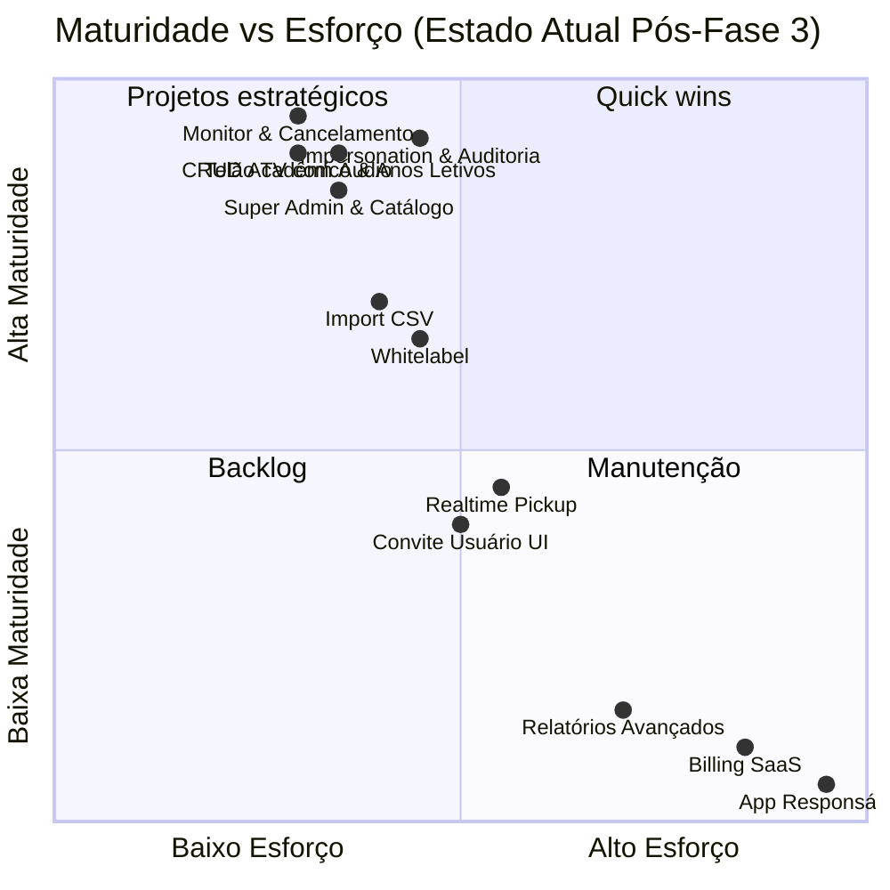

# Roadmap — Smart Exit School

Evoluções do Smart Exit School, consolidando entregas recentes concluídas e direcionamentos futuros do produto e da arquitetura.

---

## Entregas Recentes Concluídas (Fases 2 e 3)

| Entrega | PR / Commit | Escopo & Descrição |
|---|---|---|
| **Impersonation User-Level** | PRs #69, #70, #71, #73 | Suporte operacional em primeira pessoa para Platform Admins via Edge Function (`impersonate-user`), JWT manual HS256, sentinela `impersonation_no_refresh`, TTL 45min, `SupportBanner` e auditoria imutável em `public.impersonation_audit_logs`. |
| **Isolamento Multi-Tenant & Hardening** | PR #65 (Migration 0021) | Reforço de RLS, grants mínimos restritos a `authenticated`, revogação de `TRUNCATE` em todas as tabelas públicas e testes de isolamento multi-tenant cruzados. |
| **Ano Letivo Configurável** | PR #63 (Migration 0020) | Tabela `public.school_years`, vínculo formal de turmas e matrículas ao ano letivo ativo, alternância atômica via RPC `activate_school_year`. |
| **Cancelamento de Chamadas de Saída** | PR #62 (Migration 0019) | Transição operacional de status `called` → `cancelled`, registro de timestamp `cancelled_at` e modal de cancelamento com justificativa. |
| **Áudio no Telão de Saída** | PR #61 | Anúncio sonoro automático de chamadas na TV (`/tv`) combinando Chime harmônico (Web Audio API) e síntese de voz (Web Speech API) com fila sequencial e debounce. |
| **Fluxos de Senha e DX** | PR #67, PR #68, PR #72 | Telas `/forgot-password` e `/update-password` integradas ao relay SMTP Brevo, toggle de visualização `PasswordInput`, tipagens Deno e Node. |

---

## Bootstrap de produção

- [x] Produção Supabase criada e migrations aplicadas (0001 a 0022)
- [x] Frontend publicado na Vercel (`https://smart-exit-school.vercel.app`)
- [x] Platform Admin real validado (`/admin/institutions`)
- [x] Primeira instituição criada (Colégio Adventista de Esteio, plano `basic`, status `active`)
- [x] Primeiro tenant escolar validado em produção (conta de teste, membership `owner` ativa, `/painel`)
- [x] Isolamento multi-tenant e RLS endurecidos (Migration 0021)
- [ ] Provisionamento ou convite de usuários escolares via UI
- [ ] Processo de onboarding comercial self-service

---

## Próximas Prioridades (Curto e Médio Prazo)

Itens mapeados para evolução técnica imediata e melhoria operacional:

| Item | Evidência / Escopo | Prioridade sugerida |
|------|--------------------|---------------------|
| **Provisionamento de usuário escolar via UI** | Fluxo de onboarding/convite de novos membros escolares via interface (eliminando inserção manual por SQL privilegiado) | Alta |
| **Relatórios e visualizador de auditoria para Super Admin** | Interface em `/admin/institutions` para visualização e filtro dos registros de `public.impersonation_audit_logs` | Média |
| **Histórico e relatórios de saídas** | Consulta e exportação de eventos operacionais `completed` e `cancelled` para coordenação escolar | Média |
| **Referência Turma → Portão por `gate_id`** | Substituir o campo textual `defaultExit` no cache por chave estrangeira formal em `public.academic_groups` | Média |
| **Bloquear login de instituição Inativa** | Enforce do status `is_active` / `Inativo` da escola no momento da resolução de tenant no login | Alta |
| **UI bulk edit para turmas** | Expor interface para alteração em lote de turmas (handlers já existem na DAL) | Baixa |
| **Sincronização em tempo real (Supabase Realtime)** | Substituir polling de 5s no Monitor e Telão por subscrição websocket Postgres Changes em `pickup_events` | Média |

---

## Visão de Longo Prazo

Direcionamentos estratégicos e expansão do ecossistema:

| Item | Evidência / Conceito |
|------|----------------------|
| **App para responsáveis ("Estou Chegando")** | Notificação de proximidade dos pais para organização prévia da fila de saída |
| **Geolocalização e cerca virtual (Geofencing)** | Acionamento automatizado de chamada quando o responsável entra no raio do colégio |
| **Gestão de transporte e frotas escolares (Vans)** | Saída em lote de alunos vinculados a motoristas de van credenciados |
| **Faturamento e Assinaturas (Billing SaaS)** | Integração com gateway de pagamentos (Stripe/Asaas) para cobrança recorrente por plano |
| **Controle de Acesso Físico / Hardware** | Integração com catracas eletrônicas, leitores RFID e totens de identificação facial |
| **Aplicativo Mobile Nativo** | Versões mobile iOS/Android para portaria e operadores de pátio |

---

## Diagrama de Maturidade

```mermaid
quadrantChart
    title Maturidade vs Esforço (Estado Atual Pós-Fase 3)
    x-axis Baixo Esforço --> Alto Esforço
    y-axis Baixa Maturidade --> Alta Maturidade
    quadrant-1 Quick wins
    quadrant-2 Projetos estratégicos
    quadrant-3 Backlog
    quadrant-4 Manutenção

    Monitor & Cancelamento: [0.3, 0.95]
    CRUD Acadêmico & Anos Letivos: [0.35, 0.9]
    Telão TV com Áudio: [0.3, 0.9]
    Impersonation & Auditoria: [0.45, 0.92]
    Super Admin & Catálogo: [0.35, 0.85]
    Import CSV: [0.4, 0.7]
    Whitelabel: [0.45, 0.65]
    Convite Usuário UI: [0.5, 0.4]
    Realtime Pickup: [0.55, 0.45]
    App Responsáveis: [0.95, 0.05]
    Relatórios Avançados: [0.7, 0.15]
    Billing SaaS: [0.85, 0.1]
```

---

## Pontos que precisam de validação humana

- Prioridade entre convite de usuários via UI vs Realtime no telão;
- Escopo comercial da gestão de planos Trial;
- Política de retenção e expurgo dos logs de auditoria (`impersonation_audit_logs`).
