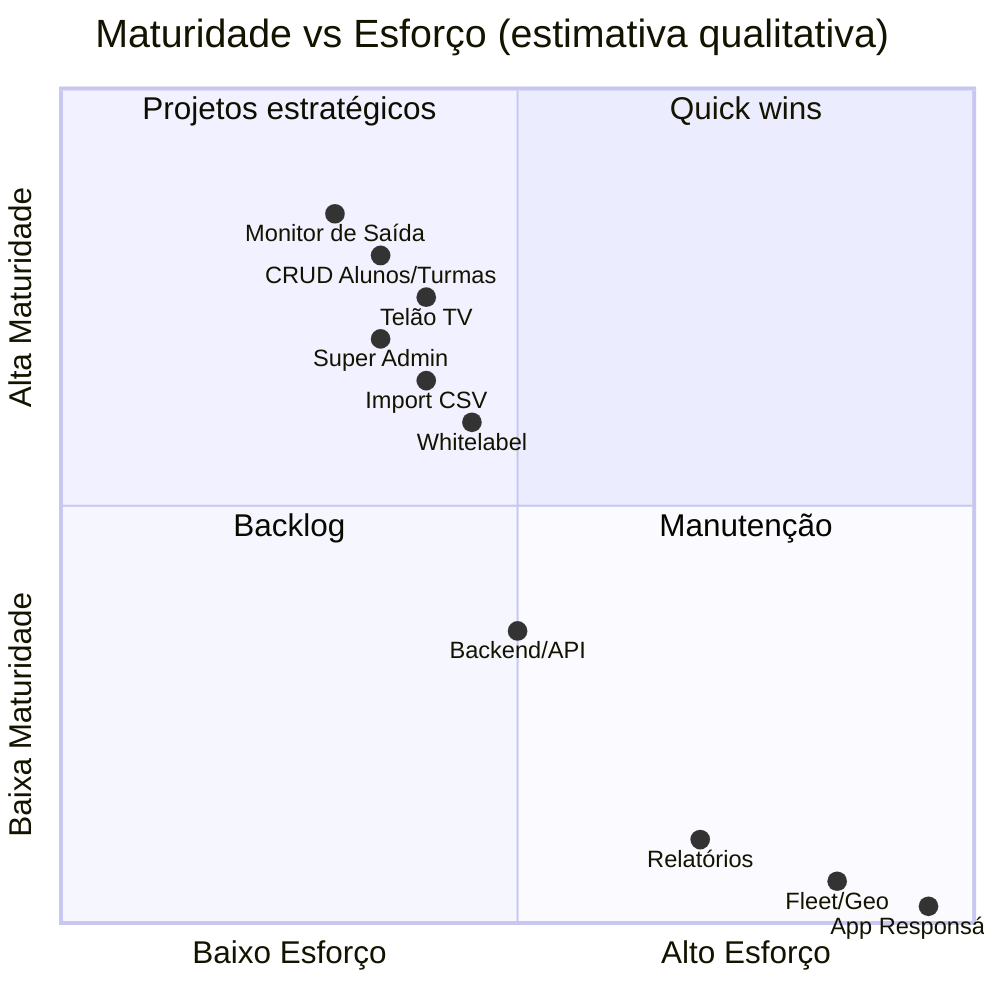

# Roadmap — Smart Exit School

Evoluções identificadas com base em placeholders de UI, código parcialmente implementado, comentários e lacunas arquiteturais. **Nenhum item abaixo está comprometido** — reflete apenas o que o código sugere ou omite.

---

## Bootstrap de produção

Fatos já observados. Não certificam isolamento multi-tenant nem substituem um fluxo de onboarding.

- [x] Produção Supabase criada e migrations aplicadas
- [x] Frontend publicado na Vercel (`https://smart-exit-school.vercel.app`)
- [x] Platform Admin real validado (`/admin/institutions`)
- [x] Primeira instituição criada (Colégio Adventista de Esteio, plano `basic`, status `active`)
- [x] Primeiro tenant escolar validado em produção (conta de teste, membership `owner` ativa, `/painel`)
- [ ] Provisionamento ou convite de usuários escolares via UI
- [ ] Teste de isolamento com duas escolas e duas identidades
- [ ] Processo de onboarding comercial

O `seed.sql` completo não foi aplicado em produção. Só o catálogo de roles foi inserido. A membership continua sendo SQL privilegiado.

## Curto prazo

Itens com base existente no código que precisam de conclusão ou correção.

| Item | Evidência | Prioridade sugerida |
|------|-----------|---------------------|
| Portões em `public.gates` | ✅ Vertical fechada e verificada em produção (`8cb71ac`, hotfix `d7d0ca5`) | — |
| Route guards | ✅ Concluídos: `usePlatformAdmin()` para `/admin/institutions` e `TenantPanelGate` para `/painel` | — |
| Testes automatizados | ✅ Concluídos: Node Test Runner nativo com 6 suítes unitárias cobrindo DAL, services e gates | — |
| CI/CD pipeline | ✅ Concluído: GitHub Actions executando lint e build automatizados em cada push/PR | — |
| Migração Supabase (Fase 2) | ✅ Concluída: escolas, portões, turmas, alunos e `pickup_events` integrados ao PostgreSQL | — |
| Referência Turma → Portão por `gate_id` | `defaultExit` ainda é texto no cache local. Sem migration nesta etapa | Média |
| UI bulk edit para turmas | Funções existem; interface ausente | Média |
| Bloquear login instituição Inativa | Status existe; não enforced | Alta |
| Remover código morto | `StudentCard`, `students.js`, `App.css`, `call.mp3` | Baixa |
| Reproduzir som de chamada | `public/sounds/call.mp3` existe | Média |
| Corrigir chaves legado | `institutions`, `currentUser` | ✅ Removido na Fase 1 DAL | — |
| Sincronizar telão mesma aba | Depende de polling 5s | Baixa |

---

## Médio prazo e Próximas fases

Funcionalidades priorizadas para evolução arquitetural e produto.

| Item | Evidência / Escopo | Prioridade |
|------|--------------------|------------|
| Isolamento de dois tenants | Validar multi-tenancy estrito por `school_id` com duas escolas e dois usuários distintos | Alta |
| Áudio no telão da TV | Anúncio sonoro da chamada de aluno (`call.mp3`) disparado no monitor/TV | Alta |
| Cancelamento de chamadas | Suporte operacional ao status `cancelled` em `public.pickup_events` | Alta |
| Ano letivo configurável | Resolver dívida técnica #1 (substituir ano letivo fixo 2026 por configuração dinâmica) | Média |
| Provisionamento de usuário escolar | Fluxo de onboarding/convite de novos membros escolares via interface (sem SQL privilegiado) | Alta |
| Histórico de saídas confirmadas | Consulta e relatórios de eventos `completed` / `cancelled` | Média |
| Relatórios avançados | "Em breve: Gráficos e inteligência de dados" | Premium+ |
| Internacionalização (i18n) | Seletor idioma Diamond; UI fixa PT | Diamond |
| API REST funcional | API Key gerada; sem endpoints | Diamond |
| Webhooks | Mencionado em Configurações Diamond | Diamond |
| Lógica plano Trial (14 dias) | Option no select admin | Trial |
| Mapeamento planos UI ↔ DB | Basic/Premium/Diamond vs basic/pro/enterprise | Média |

---

## Longo prazo

Visão de produto inferida de copy de marketing no código.

| Item | Evidência |
|------|-----------|
| App para responsáveis ("Estou Chegando") | Copy aba Fleet Diamond |
| Geolocalização de pais | Copy aba Fleet |
| Gestão de vans/frotas escolares | Copy aba Fleet |
| Fila organizada antes da chegada | Copy upgrade Diamond |
| Integração pagamentos/billing | SaaS multi-plano sem billing |
| Notificações push | Não mencionado tecnicamente |
| Portal self-service para escolas | Alteração dados "contate suporte" |
| Multi-usuário por escola (RBAC) | Apenas um login por instituição |
| Auditoria e logs centralizados | Não identificado |
| App mobile nativo | Não identificado |

---

## Diagrama de maturidade

```mermaid
quadrantChart
    title Maturidade vs Esforço (estimativa qualitativa)
    x-axis Baixo Esforço --> Alto Esforço
    y-axis Baixa Maturidade --> Alta Maturidade
    quadrant-1 Quick wins
    quadrant-2 Projetos estratégicos
    quadrant-3 Backlog
    quadrant-4 Manutenção

    Monitor de Saída: [0.3, 0.85]
    CRUD Alunos/Turmas: [0.35, 0.8]
    Telão TV: [0.4, 0.75]
    Whitelabel: [0.45, 0.6]
    Super Admin: [0.35, 0.7]
    Import CSV: [0.4, 0.65]
    Backend/API: [0.5, 0.35]
    App Responsáveis: [0.95, 0.02]
    Relatórios: [0.7, 0.1]
    Fleet/Geo: [0.85, 0.05]
```

---

## TODOs explícitos no código-fonte

| Local | Conteúdo | Tipo |
|-------|----------|------|
| `Login.jsx:33` | Comentário "configuração no futuro" | Comentário |
| `InstitutionPanel.jsx` reports | "Em breve: Gráficos..." | Placeholder UI |
| `InstitutionPanel.jsx` fleet | "Em breve: Painel de monitoramento..." | Placeholder UI |
| `App.jsx:15` | Comentário sobre cores no InstitutionPanel | Comentário |

**Nenhum `TODO`/`FIXME` formal** encontrado em arquivos do projeto (excluindo node_modules).

---

## Pontos que precisam de validação humana

- Priorização oficial do backlog
- Decisão build vs buy para backend
- Escopo MVP produção vs protótipo demo
- Prazo e escopo do plano Trial
- Integração com sistemas existentes das escolas (TOTVS, Sophia, etc.)
