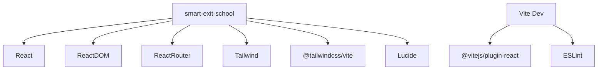

# Tecnologias — Smart Exit School

Todas as versões abaixo foram extraídas de `package.json` e `package-lock.json` na data da documentação.

## Resumo da stack

| Categoria | Tecnologia |
|-----------|------------|
| Linguagem | JavaScript (ES Modules) |
| UI Library | React 19 |
| Build Tool | Vite 8 |
| Roteamento | React Router DOM 7 |
| CSS | Tailwind CSS 4 |
| Ícones | Lucide React |
| Persistência runtime | localStorage via `storageClient` |
| Banco de dados | PostgreSQL via Supabase (schema parcial) |
| Auth (alvo) | Supabase Auth (ADR-004) |
| Lint | ESLint 10 |

## Frameworks

### React `^19.2.5`

- Biblioteca UI principal
- `StrictMode` habilitado em `main.jsx`
- Componentes funcionais com hooks (`useState`, `useEffect`, `useRef`, `useNavigate`)

### React DOM `^19.2.5`

- Renderização via `createRoot`

### React Router DOM `^7.17.0`

- Roteamento declarativo (`BrowserRouter`, `Routes`, `Route`, `Navigate`)
- Modo SPA client-side

## Bibliotecas de produção

| Pacote | Versão declarada | Versão resolvida (lock) | Uso |
|--------|------------------|-------------------------|-----|
| `react` | ^19.2.5 | 19.2.5 | Core UI |
| `react-dom` | ^19.2.5 | 19.2.5 | DOM rendering |
| `react-router-dom` | ^7.17.0 | 7.17.0 | Rotas |
| `tailwindcss` | ^4.2.4 | 4.2.4 | Estilos utility |
| `@tailwindcss/vite` | ^4.2.4 | 4.2.4 | Plugin Vite para Tailwind 4 |
| `lucide-react` | ^1.14.0 | 1.14.0 | Ícones SVG |
| `@supabase/supabase-js` | ^2.108.2 | — | Client Supabase (PostgreSQL + Auth) |

## Dependências de desenvolvimento

| Pacote | Versão declarada | Uso |
|--------|------------------|-----|
| `vite` | ^8.0.10 | Dev server e build |
| `@vitejs/plugin-react` | ^6.0.1 | HMR e JSX transform |
| `eslint` | ^10.2.1 | Linting |
| `@eslint/js` | ^10.0.1 | Config base ESLint |
| `eslint-plugin-react-hooks` | ^7.1.1 | Regras de hooks |
| `eslint-plugin-react-refresh` | ^0.5.2 | Fast Refresh |
| `globals` | ^17.5.0 | Globals browser para ESLint |
| `@types/react` | ^19.2.14 | Tipos (referência; projeto é JS) |
| `@types/react-dom` | ^19.2.3 | Tipos (referência; projeto é JS) |

## Ferramentas de build

### Vite 8

Configuração em `vite.config.js`:

```javascript
import { defineConfig } from 'vite'
import react from '@vitejs/plugin-react'
import tailwindcss from '@tailwindcss/vite'

export default defineConfig({
  plugins: [react(), tailwindcss()],
})
```

**Scripts npm:**

| Script | Comando | Descrição |
|--------|---------|-----------|
| `dev` | `vite` | Servidor de desenvolvimento com HMR |
| `build` | `vite build` | Build de produção → `dist/` |
| `preview` | `vite preview` | Preview do build local |
| `lint` | `eslint .` | Análise estática |

### Tailwind CSS 4

- Import via `@import "tailwindcss"` em `src/index.css`
- Tema customizado com `@theme` (cores `--color-primary`, `--color-secondary`, `--color-darkbg`)
- Dark mode via `@custom-variant dark (&:is(.dark *))`
- Cores dinâmicas injetadas via inline `style` com CSS variables

## Ferramentas de deploy

**Não identificadas.** Ausência de:

- Dockerfile
- docker-compose
- GitHub Actions / CI
- netlify.toml / vercel.json
- Scripts de deploy no `package.json`

## Ferramentas de desenvolvimento

| Ferramenta | Status |
|------------|--------|
| TypeScript | **Não utilizado** (apenas @types como devDep) |
| Prettier | **Não identificado** |
| Husky / lint-staged | **Não identificado** |
| Vitest / Jest / Cypress | **Não identificado** |
| Storybook | **Não identificado** |

## ESLint

Flat config (`eslint.config.js`):

- Arquivos: `**/*.{js,jsx}`
- Extends: `@eslint/js` recommended, `react-hooks`, `react-refresh` (Vite)
- Globals: `browser`
- Ignora: `dist`

## Runtime

| Requisito | Valor |
|-----------|-------|
| Node.js | **Não especificado** em `package.json` (engines ausente) |
| Navegador | Moderno com ES Modules, localStorage, FileReader API |
| Type module | `"type": "module"` no package.json |

## Tecnologias explicitamente ausentes ou pendentes

| Tecnologia | Status |
|------------|--------|
| TypeScript | Não utilizado (apenas @types como devDep) |
| API REST própria | Não implementada |
| Supabase Auth no frontend | Schema pronto; login ainda legado |
| RLS (Row Level Security) | Não implementado nas migrations |
| Testes automatizados | Não identificado |
| CI/CD | Não identificado |

## Diagrama de dependências


